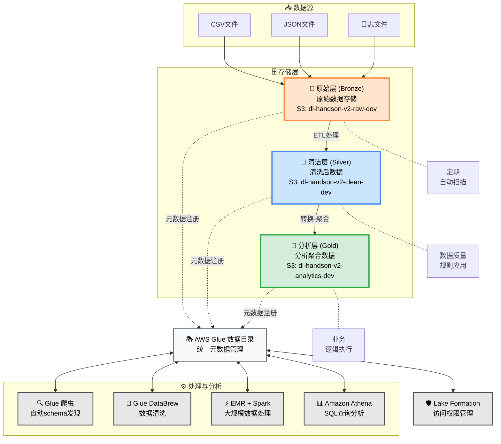
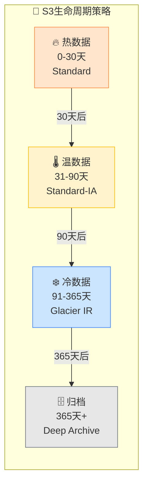

# AWS 数据湖综合实践项目 v2.1

**作者: mayinchen**

## 项目概述

本项目是一个基于AWS云服务构建企业级数据湖平台的实践性动手项目。**v2.1版本提供了优化的模块化架构和统一的CLI管理系统。**

通过多层架构设计（Raw → Clean → Analytics），实现了数据收集、存储、转换和分析的完整数据处理流水线。

## 🆕 v2.1 新功能亮点

- **统一CLI管理**: 通过 `datalake` 命令实现集中化系统管理
- **模块化架构**: 高度独立的组件设计和并行部署编排器
- **简化配置**: 使用Lake Formation Simple模式简化权限管理
- **企业级可靠性**: 全面的错误处理和重试逻辑
- **高级监控功能**: CloudTrail集成安全监控和成本优化
- **自动化部署**: 基于依赖关系的智能资源管理
- **电商数据分析**: 专门的电商数据处理和分析模块

## 目录
- [技术架构](#技术架构)
- [前置条件](#前置条件)
- [快速开始](#快速开始)
- [统一CLI使用指南](#统一cli使用指南)
- [系统配置](#系统配置)
- [模块详情](#模块详情)
- [运维管理](#运维管理)
- [故障排除](#故障排除)

## 技术架构


### 核心服务栈
- **存储层**: Amazon S3 (三层存储 + 生命周期管理)
- **数据目录**: AWS Glue (Crawler + 数据目录)
- **数据治理**: AWS Lake Formation (简化权限控制)
- **计算引擎**: Amazon EMR (Spark分布式处理)
- **分析引擎**: Amazon Athena (无服务器SQL查询)
- **监控与成本管理**: CloudTrail + AWS Budgets + CloudWatch

### 数据流架构

<div align="center">

#### 🌊 **数据湖三层架构**

</div>



<div align="center">

#### 📋 **数据处理流水线详情**

</div>

| 🏷️ **阶段** | 📂 **层级** | 📝 **说明** | 💾 **存储** | 🔧 **处理工具** | ⏱️ **频率** |
|:---:|:---:|:---|:---|:---|:---:|
| **1️⃣ 采集** | 原始层<br/>(Bronze) | 从各种数据源收集原始数据 | `s3://dl-handson-v2-raw-dev/`<br/>`└── landing/`<br/>`    └── ecommerce/` | S3 Transfer<br/>Kinesis Firehose | 实时 |
| **2️⃣ 验证** | 原始层 → 清洁层 | Schema发现和数据质量检查 | Glue Data Catalog | Glue Crawler<br/>Data Quality | 每小时 |
| **3️⃣ 转换** | 清洁层<br/>(Silver) | 数据清洗、标准化、去重 | `s3://dl-handson-v2-clean-dev/`<br/>`└── processed/`<br/>`    └── ecommerce/` | Glue DataBrew<br/>Glue ETL | 每日 |
| **4️⃣ 聚合** | 分析层<br/>(Gold) | 业务指标计算、KPI生成 | `s3://dl-handson-v2-analytics-dev/`<br/>`└── aggregated/`<br/>`    └── reports/` | EMR Spark<br/>PySpark Job | 每日/每周 |
| **5️⃣ 分析** | 查询层 | 即席分析和报表生成 | Athena Query Results | Amazon Athena<br/>QuickSight | 按需 |

<div align="center">

#### 🎯 **主要组件详情**

</div>

<table>
<tr>
<td width="50%">

**📊 数据管理组件**

| 组件 | 功能 |
|:---|:---|
| 🔍 **Glue 爬虫** | • 自动发现新数据<br/>• 自动推断Schema<br/>• 分区管理 |
| 📚 **Glue 数据目录** | • 统一元数据存储<br/>• 表定义管理<br/>• 数据血缘追踪 |
| 🛡️ **Lake Formation** | • 细粒度访问控制<br/>• 数据脱敏<br/>• 审计日志管理 |

</td>
<td width="50%">

**⚡ 处理与分析组件**

| 组件 | 功能 |
|:---|:---|
| 🧹 **Glue DataBrew** | • 可视化数据准备<br/>• 250+转换功能<br/>• 数据画像分析 |
| ⚡ **EMR + Spark** | • 大规模并行处理<br/>• 机器学习管道<br/>• 流式处理 |
| 📊 **Amazon Athena** | • 无服务器SQL分析<br/>• 标准SQL兼容<br/>• 结果缓存功能 |

</td>
</tr>
</table>

<div align="center">

#### 🔄 **数据生命周期管理**

</div>



## 前置条件

- AWS CLI已安装
- AWS认证信息已配置 (`aws configure`)
- Bash 4.0或更高版本
- Python 3.8或更高版本（用于EMR分析任务）
- 适当的IAM权限（推荐管理员权限）

## 快速开始

### 1. 环境准备
```bash
# 进入项目目录
cd /Users/umatoratatsu/Documents/AWS/AWS-Handson/Datalake/git

# 自定义配置文件（可选）
cp configs/config.env configs/config.local.env
# 编辑config.local.env调整项目配置
```

### 2. 环境变量设置
```bash
# 加载配置文件
source configs/config.env

# 确认环境变量
echo "PROJECT_PREFIX=$PROJECT_PREFIX"  # dl-handson-v2
echo "ENVIRONMENT=$ENVIRONMENT"        # dev
```

### 3. 基础部署
```bash
# 仅部署基础架构
./scripts/cli/datalake deploy
```

### 4. 完整部署（包含EMR + 分析）
```bash
# 包含EMR集群和分析任务的完整部署
./scripts/cli/datalake deploy --full
```

### 5. 系统验证
```bash
# 检查系统整体状态
./scripts/cli/datalake status

# 验证已部署的资源
./scripts/utils/check-resources.sh
```

## 统一CLI使用指南

### 基础命令

```bash
# 显示帮助
./scripts/cli/datalake help

# 查看版本
./scripts/cli/datalake version

# 检查系统状态
./scripts/cli/datalake status

# 验证配置
./scripts/cli/datalake validate
```

### 部署命令

```bash
# 基础部署（S3、IAM、Glue、Lake Formation）
./scripts/cli/datalake deploy

# 仅部署基础设施
./scripts/cli/datalake infrastructure deploy

# 部署监控模块
./scripts/cli/datalake monitoring deploy

# 完整部署（所有模块）
./scripts/cli/datalake deploy --full
```

### 模块管理

```bash
# 单个模块操作
./scripts/cli/datalake module <action> <module_name>
# actions: validate, deploy, status, cleanup, rollback
# modules: s3_storage, iam_roles, glue_catalog, lake_formation,
#          emr_cluster, cost_monitoring, cloudtrail_logging

# 示例：
./scripts/cli/datalake module deploy s3_storage
./scripts/cli/datalake module status emr_cluster
```

### 监控与分析

```bash
# 成本分析
./scripts/cli/datalake costs

# 查看CloudTrail日志（过去N小时）
./scripts/cli/datalake logs --hours 1

# 安全事件分析
./scripts/cli/datalake security

# 系统监控
./scripts/cli/datalake monitoring
```

### 清理资源

```bash
# 🆕 推荐：使用统一CLI
# 普通删除（带确认提示）
./scripts/cli/datalake destroy

# 完全删除（包括S3版本对象）
./scripts/cli/datalake destroy --force --deep-clean
```

## 系统配置

### 优化的模块化结构

```bash
scripts/
├── cli/
│   └── datalake                    # 统一CLI管理工具 v2.0.0
├── core/                           # 核心模块
│   ├── infrastructure/
│   │   ├── s3_storage.sh          # S3存储管理
│   │   └── iam_roles.sh           # IAM角色管理
│   ├── catalog/
│   │   ├── glue_catalog.sh        # Glue数据目录
│   │   └── lake_formation.sh      # Lake Formation权限管理
│   ├── compute/
│   │   └── emr_cluster.sh         # EMR集群管理
│   ├── data_processing/
│   │   └── ecommerce_analytics.py # 电商数据分析处理
│   ├── monitoring/
│   │   ├── cost_monitoring.sh     # 成本监控
│   │   └── cloudtrail_logging.sh  # 安全审计
│   └── deployment/
│       └── parallel_orchestrator.sh # 并行部署编排器
├── lib/                            # 共享库
│   ├── common.sh                   # 通用工具函数 v2.0.0
│   ├── config/
│   │   └── validator.sh           # 配置验证器
│   ├── interfaces/
│   │   └── module_interface.sh    # 模块接口定义
│   └── monitoring/
│       ├── monitor.sh             # 监控功能
│       └── tracer.py             # 追踪功能
└── utils/                          # 实用工具
    ├── check-resources.sh          # 资源检查
    ├── delete-s3-versions.py      # S3版本删除
    ├── create_glue_tables.py      # 创建Glue表
    └── table_schemas.json          # 表结构定义
```

### CloudFormation模板

```bash
templates/
├── s3-storage-layer.yaml          # S3三层存储配置
├── iam-roles-policies.yaml        # IAM角色和策略
├── glue-catalog.yaml              # Glue数据目录
├── lake-formation-simple.yaml     # 简化版Lake Formation
└── cost-monitoring.yaml           # 成本监控配置
```

## 模块详情

### 1. S3存储模块
- **功能**: 三层数据湖存储（Raw/Clean/Analytics）
- **存储桶命名**: 
  - `${PROJECT_PREFIX}-raw-${ENVIRONMENT}`
  - `${PROJECT_PREFIX}-clean-${ENVIRONMENT}`
  - `${PROJECT_PREFIX}-analytics-${ENVIRONMENT}`
- **特性**: 生命周期管理、加密、版本控制

### 2. IAM角色模块  
- **功能**: 基于最小权限原则的角色配置
- **主要角色**:
  - GlueServiceRole: Glue爬虫服务角色
  - EMRServiceRole: EMR集群服务角色
  - LakeFormationServiceRole: 数据治理服务角色

### 3. Glue数据目录模块
- **功能**: 数据目录和元数据管理
- **数据库**: `${PROJECT_PREFIX}-db`
- **数据表**: customers, products, orders, order_items

### 4. Lake Formation模块（简化版）
- **功能**: 简化的数据权限控制
- **特性**: 服务联动角色、自动权限配置

### 5. EMR集群模块
- **功能**: 基于Spark的分布式数据处理
- **集群名称**: `${PROJECT_PREFIX}-cluster-${ENVIRONMENT}`
- **默认配置**: Master (m5.xlarge) x 1, Core (m5.xlarge) x 2

### 6. 成本监控模块
- **功能**: 实时成本监控和预算告警
- **监控服务**:
  - Amazon EMR
  - Amazon S3
  - AWS Glue
  - Amazon Athena
  - AWS Lake Formation

### 7. CloudTrail日志模块
- **功能**: 安全审计和合规性跟踪
- **Trail名称**: `${PROJECT_PREFIX}-cloudtrail-${ENVIRONMENT}`

### 8. 电商数据分析模块 🆕
- **功能**: 专门的电商数据处理和分析
- **分析内容**:
  - 客户行为分析
  - 产品销售分析
  - 订单趋势分析
  - 收入统计报表

## 运维管理

### 日常监控
```bash
# 系统健康检查
./scripts/cli/datalake status

# 成本监控
./scripts/cli/datalake costs

# 资源使用情况
aws s3 ls s3://${PROJECT_PREFIX}-raw-${ENVIRONMENT} --recursive --summarize
```

### 数据分析执行
```bash
# 上传示例数据（仅首次）
./scripts/cli/datalake upload --sample-data

# 执行Glue爬虫
aws glue start-crawler --name ${PROJECT_PREFIX}-raw-crawler

# 运行电商分析任务
./scripts/cli/datalake analytics

# Athena查询执行
./scripts/cli/datalake query "SELECT * FROM customers LIMIT 10"
```

### 数据处理流水线
```bash
# 1. 数据采集
aws s3 cp data/ s3://${PROJECT_PREFIX}-raw-${ENVIRONMENT}/landing/ecommerce/ --recursive

# 2. 数据目录更新
aws glue start-crawler --name ${PROJECT_PREFIX}-raw-crawler

# 3. 数据清洗（使用DataBrew）
# 通过AWS控制台或API执行DataBrew作业

# 4. 数据分析（EMR + Spark）
./scripts/submit_pyspark_job.sh

# 5. 查询分析（Athena）
aws athena start-query-execution \
  --query-string "SELECT * FROM analytics_db.sales_summary" \
  --result-configuration "OutputLocation=s3://${PROJECT_PREFIX}-analytics-${ENVIRONMENT}/athena-results/"
```

## 故障排除

### 常见问题及解决方案

#### 1. 环境变量错误
```bash
# 问题："缺少必需的环境变量"
# 解决：加载配置文件
source configs/config.env
```

#### 2. CloudFormation栈错误
```bash
# 问题："Stack already exists"
# 解决：删除现有栈后重新部署
aws cloudformation delete-stack --stack-name <stack-name>
aws cloudformation wait stack-delete-complete --stack-name <stack-name>
```

#### 3. EMR集群连接错误
```bash
# 问题："Cannot connect to EMR cluster"
# 解决：检查安全组和密钥对
./scripts/cli/datalake module status emr_cluster
```

#### 4. 成本监控部署错误
```bash
# 问题："Budget creation failed"
# 解决：cost-monitoring.yaml的CostFilters已修复
# 已更新为使用Service维度过滤器
```

#### 5. 权限不足错误
```bash
# 问题："Access Denied"
# 解决：检查IAM角色和Lake Formation权限
./scripts/cli/datalake module deploy iam_roles
./scripts/cli/datalake module deploy lake_formation
```

### 调试模式
```bash
# 启用详细日志
export DEBUG=true
export LOG_LEVEL=DEBUG

# 调试模式运行
./scripts/cli/datalake status

# 查看模块日志
tail -f logs/datalake-*.log
```

## 预估成本与建议

### 月度成本估算（东京区域）
- **基础配置（不含EMR）**: $5-15/月
- **包含EMR配置**: $50-200/月（取决于使用时长）
- **存储成本**: $1-5/月（取决于数据量）

### 成本优化建议
1. EMR集群使用后立即删除
2. 充分利用S3生命周期策略（已自动配置）
3. 使用Spot实例可降低EMR成本60-70%
4. 定期查看成本监控报告
5. 使用并行部署编排器减少部署时间

## 安全最佳实践

- IAM角色遵循最小权限原则
- S3存储桶启用加密和版本控制
- Lake Formation实现细粒度访问控制
- CloudTrail记录所有操作审计日志
- 建议使用VPC端点提高安全性
- 定期进行安全事件分析
- 敏感数据自动脱敏处理

## 项目特色

### 🎯 核心优势
1. **模块化设计**: 每个组件独立部署，易于维护
2. **并行部署**: 智能依赖解析，加速部署过程
3. **电商场景**: 内置电商数据模型和分析案例
4. **中文支持**: 完整的中文注释和文档
5. **成本优化**: 自动化成本监控和优化建议

### 📊 数据模型
- **客户表** (customers): 客户基础信息
- **产品表** (products): 产品目录数据
- **订单表** (orders): 订单交易记录
- **订单明细表** (order_items): 订单商品明细

## 许可证

本项目基于MIT许可证发布。

---

**作者**: mayinchen  
**版本**: 2.1  
**最后更新**: 2025年7月

**重要提示**: 本项目为学习目的创建。在生产环境使用前，请充分验证安全和成本配置。

**充分利用v2.1的优化功能，实现高效的数据湖管理！**