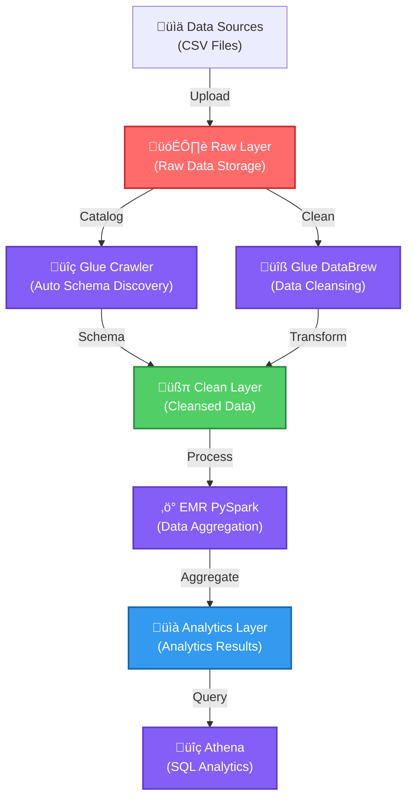

# AWS Data Lake Comprehensive Hands-on Project v2.1

**Author: mayinchen**

## Project Overview

This project is a practical hands-on project for building an enterprise-level data lake platform from scratch based on AWS cloud services. **v2.1 provides an optimized modular architecture and unified CLI management system.**

The multi-tier architecture design (Raw → Clean → Analytics) implements a complete data processing pipeline for data collection, storage, transformation, and analysis.

## 🆕 v2.1 New Features

- **Unified CLI Management**: Centralized system management via `datalake` command
- **Modular Architecture**: Highly independent component design with parallel deployment
- **Simplified Configuration**: Simplified permission management with Lake Formation Simple
- **Enterprise-level Reliability**: Comprehensive error handling and retry logic
- **Advanced Monitoring**: CloudTrail integrated security monitoring and cost optimization
- **Automated Deployment**: Intelligent resource management considering dependencies

## Table of Contents
- [Technical Architecture](#technical-architecture)
- [Prerequisites](#prerequisites)
- [Quick Start](#quick-start)
- [Unified CLI Usage Guide](#unified-cli-usage-guide)
- [System Configuration](#system-configuration)
- [Module Details](#module-details)
- [Operations Management](#operations-management)
- [Troubleshooting](#troubleshooting)

## Technical Architecture


### Core Service Stack
- **Storage Layer**: Amazon S3 (3-tier storage + lifecycle management)
- **Data Catalog**: AWS Glue (Crawler + Data Catalog)
- **Data Governance**: AWS Lake Formation (simplified permission control)
- **Compute Engine**: Amazon EMR (Spark distributed processing)
- **Analytics Engine**: Amazon Athena (serverless SQL queries)
- **Monitoring & Cost Management**: CloudTrail + AWS Budgets + CloudWatch

### Data Flow Architecture

<div align="center">

#### 🌊 **Data Lake 3-Tier Architecture**

</div>



## Prerequisites

### 1. Required Environment
- Python 3.8+
- AWS CLI v2+
- jq command line tool
- Bash 4.0+ (macOS users need to update)

### 2. AWS Account Requirements
- Administrator access or equivalent permissions
- Service quotas: S3, Glue, EMR, Lake Formation, CloudFormation

### 3. Local Environment Setup
```bash
# Clone the project
git clone https://github.com/yourusername/aws-datalake-handson.git
cd aws-datalake-handson

# Install dependencies
pip install -r requirements.txt

# AWS CLI configuration
aws configure
```

## Quick Start

### 1. Basic Deployment (Infrastructure Only)
```bash
# Execute basic deployment using unified CLI
./scripts/cli/datalake deploy

# Check deployment status
./scripts/cli/datalake status
```

### 2. Full Deployment (Including Analytics)
```bash
# Full deployment including EMR cluster and analytics jobs
./scripts/cli/datalake deploy --full

# Monitor deployment progress
./scripts/cli/datalake monitoring
```

### 3. Cleanup Resources
```bash
# Basic resource cleanup
./scripts/cli/datalake destroy

# Complete cleanup of all resources (recommended)
./scripts/cli/datalake destroy --force --deep-clean

# Individual module cleanup
./scripts/cli/datalake module cleanup emr_cluster
```

## Unified CLI Usage Guide

**🆕 NEW in v2.1**: The project now includes a unified CLI system (`./scripts/cli/datalake`) that provides centralized management for all data lake operations. This is the **recommended** way to manage your data lake:

### Why Use the New CLI?
- **Simplified Commands**: Single entry point for all operations
- **Modular Management**: Deploy and manage individual components
- **Better Error Handling**: Integrated retry logic and validation
- **Consistent Interface**: Unified command structure across all operations

### Basic Commands
```bash
# Display help
./scripts/cli/datalake help

# Check system status
./scripts/cli/datalake status

# View configuration
./scripts/cli/datalake config
```

### Deployment Management
```bash
# Basic deployment
./scripts/cli/datalake deploy

# Individual module deployment
./scripts/cli/datalake module deploy s3_storage

# Deployment with EMR
./scripts/cli/datalake deploy --emr

# Execute analytics job
./scripts/cli/datalake analytics
```

### Monitoring and Management
```bash
# Real-time monitoring
./scripts/cli/datalake monitoring

# Cost report
./scripts/cli/datalake costs

# Resource validation
./scripts/cli/datalake validate
```

## System Configuration

### 1. Configuration File Structure
```
configs/
├── config.env          # Main configuration template
├── config.local.env    # Local overrides (gitignored)
└── env-vars.sh        # Auto-generated environment variables
```

### 2. Key Configuration Items
```bash
# Project settings
PROJECT_PREFIX=dl-handson    # Resource name prefix
ENVIRONMENT=dev              # Environment (dev/staging/prod)
AWS_REGION=us-east-1        # AWS region

# S3 configuration
S3_VERSIONING=Enabled       # Version control
S3_LIFECYCLE_ENABLED=true   # Lifecycle management

# EMR configuration
EMR_INSTANCE_TYPE=m5.xlarge # Instance type
EMR_INSTANCE_COUNT=3        # Number of instances
```

### 3. Environment Variable Management
```bash
# Load configuration
source configs/env-vars.sh

# Validate configuration
./scripts/lib/config/validator.sh
```

## Module Details

### 1. Core Infrastructure Module
- **S3 Storage**: Multi-layer bucket architecture with encryption
- **IAM Roles**: Least-privilege security policies
- **VPC Configuration**: Network isolation and security groups

### 2. Data Catalog Module
- **Glue Database**: Centralized metadata repository
- **Glue Crawlers**: Automatic schema discovery
- **Table Definitions**: Structured data catalog

### 3. Data Processing Module
- **EMR Cluster**: Managed Spark environment
- **PySpark Jobs**: Scalable data transformations
- **Job Orchestration**: Automated workflow management

### 4. Analytics Module
- **Athena Setup**: Serverless query engine
- **Query Optimization**: Partitioning and compression
- **Result Storage**: Query result management

### 5. Monitoring Module
- **CloudTrail**: Security audit logs
- **CloudWatch**: Performance metrics
- **Cost Monitoring**: Budget alerts and optimization

## Operations Management

### 1. Daily Operations
```bash
# Check system health
./scripts/cli/datalake status

# View recent activities
./scripts/cli/datalake logs --hours 24

# Run analytics job
./scripts/cli/datalake analytics
```

### 2. Cost Optimization
```bash
# Generate cost report
./scripts/cli/datalake costs

# Run cost monitoring script
./scripts/cost-optimization.sh

# Deploy cost monitoring module
./scripts/cli/datalake module deploy cost_monitoring
```

### 3. Security Management
```bash
# Security analysis
./scripts/cli/datalake security

# Validate configuration
./scripts/cli/datalake validate

# Check CloudTrail logs
./scripts/cli/datalake logs
```

## Troubleshooting

### Common Issues

1. **Deployment Failures**
   ```bash
   # Check system status
   ./scripts/cli/datalake status
   
   # Retry failed deployments
   ./scripts/cli/datalake deploy
   ```

2. **Permission Issues**
   ```bash
   # Verify configuration
   ./scripts/cli/datalake validate
   
   # Redeploy IAM roles
   ./scripts/cli/datalake module deploy iam_roles
   ```

3. **EMR Cluster Issues**
   ```bash
   # Check EMR cluster status
   ./scripts/cli/datalake module status emr_cluster
   
   # Redeploy EMR cluster
   ./scripts/cli/datalake module deploy emr_cluster
   ```

### Debug Mode
```bash
# Enable debug logging
export LOG_LEVEL=DEBUG

# Run deployment
./scripts/cli/datalake deploy
```

## Project Structure
```
aws-datalake-handson/
├── scripts/              # Deployment and management scripts
│   ├── cli/
│   │   └── datalake     # 🆕 Unified CLI entry point (RECOMMENDED)
│   ├── deploy-all.sh    # Legacy deployment script (fallback only)
│   ├── core/           # Core modules
│   ├── lib/            # Shared libraries
│   └── utils/          # Utility scripts
├── templates/           # CloudFormation templates
├── configs/            # Configuration files
├── sample-data/        # Sample datasets
└── docs/              # Documentation
```

### 🔄 Migration from Legacy Scripts
If you're upgrading from an older version:

**New Way** (v2.1+, **Recommended**):
```bash
# Deployment
./scripts/cli/datalake deploy --full
# Cost monitoring
./scripts/cli/datalake costs
```

## Best Practices

1. **Security**
   - Use IAM roles instead of access keys
   - Enable S3 bucket encryption
   - Implement least-privilege access
   - Regular security audits

2. **Cost Optimization**
   - Use spot instances for EMR
   - Implement S3 lifecycle policies
   - Monitor and set budget alerts
   - Regular resource cleanup with CloudFormation

3. **Performance**
   - Partition data appropriately
   - Use columnar formats (Parquet)
   - Optimize Spark configurations
   - Implement data compression

4. **Reliability**
   - Implement retry mechanisms
   - Use CloudFormation for IaC
   - Regular backups
   - Monitoring and alerting

## Contributing

Contributions are welcome! Please read our contributing guidelines and submit pull requests to our repository.

## License

This project is licensed under the MIT License - see the LICENSE file for details.

## Support

For issues and questions:
- GitHub Issues: [Project Issues](https://github.com/yourusername/aws-datalake-handson/issues)
- Documentation: [Project Wiki](https://github.com/yourusername/aws-datalake-handson/wiki)

---
**Author**: mayinchen  
**Version**: 2.1  
**Last Updated**: 2025.7