# AWS Data Lake Comprehensive Hands-on Project v2.1

**Author: mayinchen**

## Project Overview

This project is a practical hands-on project for building an enterprise-level data lake platform from scratch based on AWS cloud services. **v2.1 provides an optimized modular architecture and unified CLI management system.**

The multi-tier architecture design (Raw → Clean → Analytics) implements a complete data processing pipeline for data collection, storage, transformation, and analysis.

## 🆕 v2.1 New Features Highlights

- **Unified CLI Management**: Centralized system management via `datalake` command
- **Modular Architecture**: Highly independent component design with parallel deployment orchestrator
- **Simplified Configuration**: Simplified permission management with Lake Formation Simple mode
- **Enterprise-level Reliability**: Comprehensive error handling and retry logic
- **Advanced Monitoring**: CloudTrail integrated security monitoring and cost optimization
- **Automated Deployment**: Intelligent resource management with dependency-aware deployment
- **E-commerce Analytics**: Dedicated e-commerce data processing and analytics module
- **Parallel Orchestration**: Optimized deployment time with intelligent parallel execution

## Table of Contents
- [Technical Architecture](#technical-architecture)
- [Prerequisites](#prerequisites)
- [Quick Start](#quick-start)
- [Unified CLI Usage Guide](#unified-cli-usage-guide)
- [System Configuration](#system-configuration)
- [Module Details](#module-details)
- [Operations Management](#operations-management)
- [Troubleshooting](#troubleshooting)

## Technical Architecture


### Core Service Stack
- **Storage Layer**: Amazon S3 (3-tier storage + lifecycle management)
- **Data Catalog**: AWS Glue (Crawler + Data Catalog)
- **Data Governance**: AWS Lake Formation (simplified permission control)
- **Compute Engine**: Amazon EMR (Spark distributed processing)
- **Analytics Engine**: Amazon Athena (serverless SQL queries)
- **Monitoring & Cost Management**: CloudTrail + AWS Budgets + CloudWatch

### Data Flow Architecture

<div align="center">

#### 🌊 **Data Lake 3-Tier Architecture**

```mermaid
graph TB
    %% Style definitions
    classDef rawStyle fill:#FFE5CC,stroke:#FF8C42,stroke-width:3px,color:#000
    classDef cleanStyle fill:#CCE5FF,stroke:#4285F4,stroke-width:3px,color:#000
    classDef analyticsStyle fill:#D4EDDA,stroke:#28A745,stroke-width:3px,color:#000
    classDef catalogStyle fill:#F8F9FA,stroke:#6C757D,stroke-width:2px,color:#000
    classDef processStyle fill:#E7E7E7,stroke:#495057,stroke-width:2px,color:#000
    
    %% Data Sources
    subgraph sources["📥 Data Sources"]
        DS1[CSV Files]
        DS2[JSON Files]
        DS3[Log Files]
    end
    
    %% Storage Layers
    subgraph storage["🗄️ Storage Layers"]
        RAW["🥉 Raw Layer (Bronze)<br/>Raw Data Storage<br/>S3: dl-handson-v2-raw-dev"]:::rawStyle
        CLEAN["🥈 Clean Layer (Silver)<br/>Cleansed Data<br/>S3: dl-handson-v2-clean-dev"]:::cleanStyle
        ANALYTICS["🥇 Analytics Layer (Gold)<br/>Aggregated Data<br/>S3: dl-handson-v2-analytics-dev"]:::analyticsStyle
    end
    
    %% Catalog Layer
    CATALOG["📚 AWS Glue Data Catalog<br/>Unified Metadata Management"]:::catalogStyle
    
    %% Processing Layer
    subgraph processing["⚙️ Processing & Analytics"]
        CRAWLER["🔍 Glue Crawler<br/>Auto Schema Discovery"]:::processStyle
        DATABREW["🧹 Glue DataBrew<br/>Data Cleansing"]:::processStyle
        EMR["⚡ EMR + Spark<br/>Large-scale Processing"]:::processStyle
        ATHENA["📊 Amazon Athena<br/>SQL Query Analysis"]:::processStyle
    end
    
    %% Governance
    LAKEFORMATION["🛡️ Lake Formation<br/>Access Permission Management"]:::processStyle
    
    %% Data Flow
    DS1 --> RAW
    DS2 --> RAW
    DS3 --> RAW
    
    RAW -->|ETL Processing| CLEAN
    CLEAN -->|Transform & Aggregate| ANALYTICS
    
    RAW -.->|Metadata Registration| CATALOG
    CLEAN -.->|Metadata Registration| CATALOG
    ANALYTICS -.->|Metadata Registration| CATALOG
    
    CATALOG <--> CRAWLER
    CATALOG <--> DATABREW
    CATALOG <--> EMR
    CATALOG <--> ATHENA
    
    CATALOG <--> LAKEFORMATION
    
    %% Annotations
    RAW -.- crawlerNote["Periodic<br/>Auto Scan"]
    CLEAN -.- databrewNote["Data Quality<br/>Rules Applied"]
    ANALYTICS -.- emrNote["Business<br/>Logic Execution"]
```

</div>



## Prerequisites

- AWS CLI installed
- AWS credentials configured (`aws configure`)
- Bash 4.0 or higher
- Python 3.8 or higher (for EMR analytics jobs)
- Appropriate IAM permissions (Administrator access recommended)

## Quick Start

### 1. Environment Setup
```bash
# Navigate to project directory
cd /Users/umatoratatsu/Documents/AWS/AWS-Handson/Datalake/git

# Customize configuration (optional)
cp configs/config.env configs/config.local.env
# Edit config.local.env to adjust project settings
```

### 2. Set Environment Variables
```bash
# Load configuration
source configs/config.env

# Verify environment variables
echo "PROJECT_PREFIX=$PROJECT_PREFIX"  # dl-handson-v2
echo "ENVIRONMENT=$ENVIRONMENT"        # dev
```

### 3. Basic Deployment
```bash
# Deploy base infrastructure only
./scripts/cli/datalake deploy
```

### 4. Full Deployment (with EMR + Analytics)
```bash
# Complete deployment including EMR cluster and analytics jobs
./scripts/cli/datalake deploy --full
```

### 5. System Verification
```bash
# Check overall system status
./scripts/cli/datalake status

# Verify deployed resources
./scripts/utils/check-resources.sh
```

## Unified CLI Usage Guide

### Basic Commands

```bash
# Display help
./scripts/cli/datalake help

# Check version
./scripts/cli/datalake version

# System status check
./scripts/cli/datalake status

# Validate configuration
./scripts/cli/datalake validate
```

### Deployment Commands

```bash
# Basic deployment (S3, IAM, Glue, Lake Formation)
./scripts/cli/datalake deploy

# Infrastructure only deployment
./scripts/cli/datalake infrastructure deploy

# Deploy monitoring modules
./scripts/cli/datalake monitoring deploy

# Full deployment (all modules)
./scripts/cli/datalake deploy --full
```

### Module Management

```bash
# Individual module operations
./scripts/cli/datalake module <action> <module_name>
# actions: validate, deploy, status, cleanup, rollback
# modules: s3_storage, iam_roles, glue_catalog, lake_formation,
#          emr_cluster, cost_monitoring, cloudtrail_logging

# Examples:
./scripts/cli/datalake module deploy s3_storage
./scripts/cli/datalake module status emr_cluster
```

### Monitoring & Analytics

```bash
# Cost analysis
./scripts/cli/datalake costs

# View CloudTrail logs (past N hours)
./scripts/cli/datalake logs --hours 1

# Security event analysis
./scripts/cli/datalake security

# System monitoring
./scripts/cli/datalake monitoring
```

### Resource Cleanup

```bash
# 🆕 Recommended: Use unified CLI
# Normal deletion (with confirmation)
./scripts/cli/datalake destroy

# Complete deletion (including S3 version objects)
./scripts/cli/datalake destroy --force --deep-clean
```

## System Configuration

### Optimized Modular Architecture

```bash
scripts/
├── cli/
│   └── datalake                    # Unified CLI management tool v2.0.0
├── core/                           # Core modules
│   ├── infrastructure/
│   │   ├── s3_storage.sh          # S3 storage management
│   │   └── iam_roles.sh           # IAM role management
│   ├── catalog/
│   │   ├── glue_catalog.sh        # Glue data catalog
│   │   └── lake_formation.sh      # Lake Formation permissions
│   ├── compute/
│   │   └── emr_cluster.sh         # EMR cluster management
│   ├── data_processing/
│   │   └── ecommerce_analytics.py # E-commerce analytics processing
│   ├── monitoring/
│   │   ├── cost_monitoring.sh     # Cost monitoring
│   │   └── cloudtrail_logging.sh  # Security audit
│   └── deployment/
│       └── parallel_orchestrator.sh # Parallel deployment orchestrator
├── lib/                            # Shared libraries
│   ├── common.sh                   # Common utilities v2.0.0
│   ├── config/
│   │   └── validator.sh           # Configuration validator
│   ├── interfaces/
│   │   └── module_interface.sh    # Module interface definitions
│   └── monitoring/
│       ├── monitor.sh             # Monitoring functions
│       └── tracer.py             # Tracing utilities
└── utils/                          # Utility tools
    ├── check-resources.sh          # Resource verification
    ├── delete-s3-versions.py      # S3 version cleanup
    ├── create_glue_tables.py      # Glue table creation
    └── table_schemas.json          # Table schema definitions
```

### CloudFormation Templates

```bash
templates/
├── s3-storage-layer.yaml          # S3 3-tier storage configuration
├── iam-roles-policies.yaml        # IAM roles and policies
├── glue-catalog.yaml              # Glue data catalog
├── lake-formation-simple.yaml     # Simplified Lake Formation
└── cost-monitoring.yaml           # Cost monitoring setup
```

## Module Details

### 1. S3 Storage Module
- **Function**: 3-tier data lake storage (Raw/Clean/Analytics)
- **Bucket Naming**: 
  - `${PROJECT_PREFIX}-raw-${ENVIRONMENT}`
  - `${PROJECT_PREFIX}-clean-${ENVIRONMENT}`
  - `${PROJECT_PREFIX}-analytics-${ENVIRONMENT}`
- **Features**: Lifecycle management, encryption, versioning

### 2. IAM Roles Module  
- **Function**: Role configuration based on least privilege principle
- **Main Roles**:
  - GlueServiceRole: For Glue crawler service
  - EMRServiceRole: For EMR cluster service
  - LakeFormationServiceRole: For data governance

### 3. Glue Catalog Module
- **Function**: Data catalog and metadata management
- **Database**: `${PROJECT_PREFIX}-db`
- **Tables**: customers, products, orders, order_items

### 4. Lake Formation Module (Simplified)
- **Function**: Simplified data permission control
- **Features**: Service-linked roles, automatic permission configuration

### 5. EMR Cluster Module
- **Function**: Spark-based distributed data processing
- **Cluster Name**: `${PROJECT_PREFIX}-cluster-${ENVIRONMENT}`
- **Default Config**: Master (m5.xlarge) x 1, Core (m5.xlarge) x 2

### 6. Cost Monitoring Module
- **Function**: Real-time cost monitoring and budget alerts
- **Monitored Services**:
  - Amazon EMR
  - Amazon S3
  - AWS Glue
  - Amazon Athena
  - AWS Lake Formation

### 7. CloudTrail Logging Module
- **Function**: Security audit and compliance tracking
- **Trail Name**: `${PROJECT_PREFIX}-cloudtrail-${ENVIRONMENT}`

### 8. E-commerce Analytics Module 🆕
- **Function**: Dedicated e-commerce data processing and analytics
- **Analytics Content**:
  - Customer behavior analysis
  - Product sales analysis
  - Order trend analysis
  - Revenue reporting

## Operations Management

### Daily Monitoring
```bash
# System health check
./scripts/cli/datalake status

# Cost monitoring
./scripts/cli/datalake costs

# Resource usage
aws s3 ls s3://${PROJECT_PREFIX}-raw-${ENVIRONMENT} --recursive --summarize
```

### Data Analysis Execution
```bash
# Upload sample data (first time only)
./scripts/cli/datalake upload --sample-data

# Run Glue crawler
aws glue start-crawler --name ${PROJECT_PREFIX}-raw-crawler

# Execute e-commerce analytics
./scripts/cli/datalake analytics

# Run Athena query
./scripts/cli/datalake query "SELECT * FROM customers LIMIT 10"
```

### Data Processing Pipeline
```bash
# 1. Data Collection
aws s3 cp data/ s3://${PROJECT_PREFIX}-raw-${ENVIRONMENT}/landing/ecommerce/ --recursive

# 2. Update Data Catalog
aws glue start-crawler --name ${PROJECT_PREFIX}-raw-crawler

# 3. Data Cleansing (using DataBrew)
# Execute DataBrew job via AWS Console or API

# 4. Data Analytics (EMR + Spark)
./scripts/submit_pyspark_job.sh

# 5. Query Analysis (Athena)
aws athena start-query-execution \
  --query-string "SELECT * FROM analytics_db.sales_summary" \
  --result-configuration "OutputLocation=s3://${PROJECT_PREFIX}-analytics-${ENVIRONMENT}/athena-results/"
```

## Troubleshooting

### Common Issues and Solutions

#### 1. Environment Variable Error
```bash
# Issue: "Missing required environment variables"
# Solution: Load configuration file
source configs/config.env
```

#### 2. CloudFormation Stack Error
```bash
# Issue: "Stack already exists"
# Solution: Delete existing stack and redeploy
aws cloudformation delete-stack --stack-name <stack-name>
aws cloudformation wait stack-delete-complete --stack-name <stack-name>
```

#### 3. EMR Cluster Connection Error
```bash
# Issue: "Cannot connect to EMR cluster"
# Solution: Check security groups and key pairs
./scripts/cli/datalake module status emr_cluster
```

#### 4. Cost Monitoring Deployment Error
```bash
# Issue: "Budget creation failed"
# Solution: CostFilters in cost-monitoring.yaml has been fixed
# Updated to use Service dimension filters
```

#### 5. Permission Denied Error
```bash
# Issue: "Access Denied"
# Solution: Check IAM roles and Lake Formation permissions
./scripts/cli/datalake module deploy iam_roles
./scripts/cli/datalake module deploy lake_formation
```

### Debug Mode
```bash
# Enable detailed logging
export DEBUG=true
export LOG_LEVEL=DEBUG

# Run in debug mode
./scripts/cli/datalake status

# View module logs
tail -f logs/datalake-*.log
```

## Estimated Costs and Recommendations

### Monthly Cost Estimation (Tokyo Region)
- **Basic Configuration (without EMR)**: $5-15/month
- **Configuration with EMR**: $50-200/month (depends on usage)
- **Storage**: $1-5/month (depends on data volume)

### Cost Optimization Tips
1. Delete EMR clusters immediately after use
2. Leverage S3 lifecycle policies (automatically configured)
3. Use Spot instances to reduce EMR costs by 60-70%
4. Regularly review cost monitoring reports
5. Use parallel deployment orchestrator to reduce deployment time

## Security Best Practices

- IAM roles follow the principle of least privilege
- S3 buckets have encryption and versioning enabled
- Lake Formation provides fine-grained access control
- CloudTrail records all operation audit logs
- VPC endpoints recommended for enhanced security
- Regular security event analysis
- Automatic data masking for sensitive information

## Project Features

### 🎯 Core Advantages
1. **Modular Design**: Each component can be deployed independently
2. **Parallel Deployment**: Intelligent dependency resolution for faster deployment
3. **E-commerce Scenario**: Built-in e-commerce data model and analytics examples
4. **Chinese Support**: Complete Chinese comments and documentation in code
5. **Cost Optimization**: Automated cost monitoring and optimization recommendations

### 📊 Data Model
- **Customers Table**: Customer profile information
- **Products Table**: Product catalog data
- **Orders Table**: Order transaction records
- **Order Items Table**: Order item details

## Data Processing Pipeline Details

| 🏷️ **Stage** | 📂 **Layer** | 📝 **Description** | 💾 **Storage** | 🔧 **Processing Tools** | ⏱️ **Frequency** |
|:---:|:---:|:---|:---|:---|:---:|
| **1️⃣ Collection** | Raw<br/>(Bronze) | Collect raw data from various sources | `s3://dl-handson-v2-raw-dev/`<br/>`└── landing/`<br/>`    └── ecommerce/` | S3 Transfer<br/>Kinesis Firehose | Real-time |
| **2️⃣ Validation** | Raw → Clean | Schema discovery and data quality checks | Glue Data Catalog | Glue Crawler<br/>Data Quality | Hourly |
| **3️⃣ Transformation** | Clean<br/>(Silver) | Data cleansing, normalization, deduplication | `s3://dl-handson-v2-clean-dev/`<br/>`└── processed/`<br/>`    └── ecommerce/` | Glue DataBrew<br/>Glue ETL | Daily |
| **4️⃣ Aggregation** | Analytics<br/>(Gold) | Business metrics calculation, KPI generation | `s3://dl-handson-v2-analytics-dev/`<br/>`└── aggregated/`<br/>`    └── reports/` | EMR Spark<br/>PySpark Job | Daily/Weekly |
| **5️⃣ Analysis** | Query Layer | Ad-hoc analysis and report generation | Athena Query Results | Amazon Athena<br/>QuickSight | On-demand |

## License

This project is licensed under the MIT License.

---
**Author**: mayinchen  
**Version**: 2.1  
**Last Updated**: July 2025

**Important**: This project is created for learning purposes. Please thoroughly validate security and cost configurations before using in production.

**Leverage the optimized features of v2.1 to achieve efficient data lake management!**