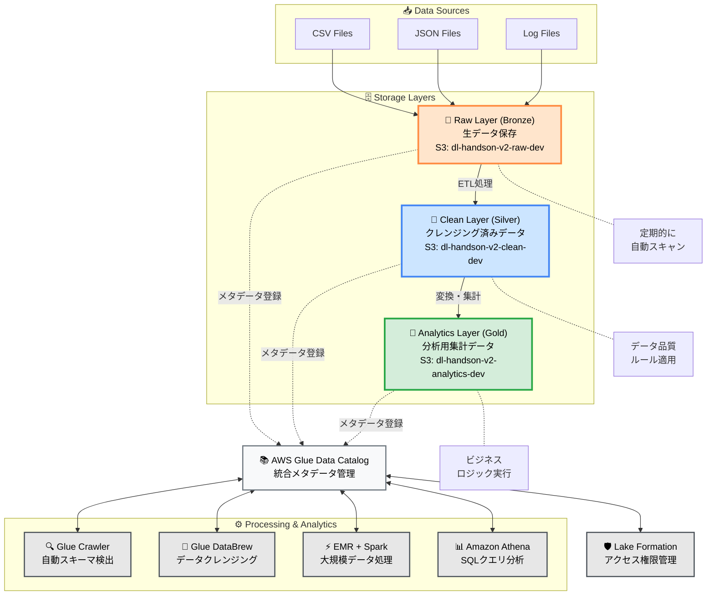
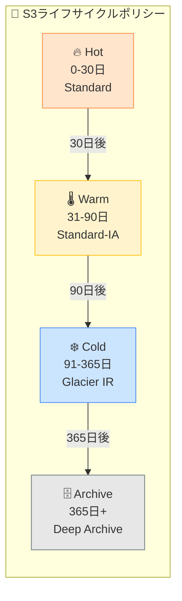

# AWS データレイク総合実践プロジェクト v2.1

## プロジェクト概要

本プロジェクトは、AWSクラウドサービスを基盤としたエンタープライズレベルのデータレイクプラットフォームをゼロから構築するための実践的なハンズオンプロジェクトです。**v2.1では最適化されたモジュラーアーキテクチャと統一されたCLI管理システムを提供します。**

多層アーキテクチャ設計（Raw → Clean → Analytics）により、データの収集、保存、変換、分析の完全なデータ処理パイプラインを実現しています。

## 🆕 v2.1 新機能ハイライト

- **統一CLI管理**: `datalake` コマンドによる一元化されたシステム管理
- **モジュラーアーキテクチャ**: 独立性の高いコンポーネント設計と並列デプロイメント
- **簡素化された設定**: Lake Formation Simpleによる権限管理の簡易化
- **企業レベルの信頼性**: 包括的なエラーハンドリングとリトライロジック
- **高度な監視機能**: CloudTrail統合セキュリティ監視とコスト最適化
- **自動化されたデプロイ**: 依存関係を考慮したインテリジェントなリソース管理

## 目次
- [技術アーキテクチャ](#技術アーキテクチャ)
- [前提条件](#前提条件)
- [クイックスタート](#クイックスタート)
- [統一CLI使用ガイド](#統一cli使用ガイド)
- [システム構成](#システム構成)
- [モジュール詳細](#モジュール詳細)
- [運用管理](#運用管理)
- [トラブルシューティング](#トラブルシューティング)

## 技術アーキテクチャ


### コアサービススタック
- **ストレージ層**: Amazon S3 (3層ストレージ + ライフサイクル管理)
- **データカタログ**: AWS Glue (Crawler + データカタログ)
- **データガバナンス**: AWS Lake Formation (簡素化された権限制御)
- **計算エンジン**: Amazon EMR (Spark分散処理)
- **分析エンジン**: Amazon Athena (サーバーレス SQL クエリ)
- **監視・コスト管理**: CloudTrail + AWS Budgets + CloudWatch

### データフローアーキテクチャ

<div align="center">

#### 🌊 **データレイク3層アーキテクチャ**

</div>



<div align="center">

#### 📋 **データ処理パイプライン詳細**

</div>

| 🏷️ **ステージ** | 📂 **レイヤー** | 📝 **説明** | 💾 **ストレージ** | 🔧 **処理ツール** | ⏱️ **頻度** |
|:---:|:---:|:---|:---|:---|:---:|
| **1️⃣ 収集** | Raw<br/>(Bronze) | 様々なソースからの生データをそのまま保存 | `s3://dl-handson-v2-raw-dev/`<br/>`└── landing/`<br/>`    └── ecommerce/` | S3 Transfer<br/>Kinesis Firehose | リアルタイム |
| **2️⃣ 検証** | Raw → Clean | スキーマ検出とデータ品質チェック | Glue Data Catalog | Glue Crawler<br/>Data Quality | 1時間毎 |
| **3️⃣ 変換** | Clean<br/>(Silver) | データクレンジング、正規化、重複排除 | `s3://dl-handson-v2-clean-dev/`<br/>`└── processed/`<br/>`    └── ecommerce/` | Glue DataBrew<br/>Glue ETL | 日次 |
| **4️⃣ 集計** | Analytics<br/>(Gold) | ビジネスメトリクス計算、KPI生成 | `s3://dl-handson-v2-analytics-dev/`<br/>`└── aggregated/`<br/>`    └── reports/` | EMR Spark<br/>PySpark Job | 日次/週次 |
| **5️⃣ 分析** | Query Layer | アドホック分析とレポート作成 | Athena Query Results | Amazon Athena<br/>QuickSight | オンデマンド |

<div align="center">

#### 🎯 **主要コンポーネントの詳細**

</div>

<table>
<tr>
<td width="50%">

**📊 データ管理コンポーネント**

| コンポーネント | 役割 |
|:---|:---|
| 🔍 **Glue Crawler** | • 新規データの自動検出<br/>• スキーマの自動推論<br/>• パーティション管理 |
| 📚 **Glue Data Catalog** | • 統一メタデータストア<br/>• テーブル定義管理<br/>• データ系譜追跡 |
| 🛡️ **Lake Formation** | • 細粒度アクセス制御<br/>• データマスキング<br/>• 監査ログ管理 |

</td>
<td width="50%">

**⚡ 処理・分析コンポーネント**

| コンポーネント | 役割 |
|:---|:---|
| 🧹 **Glue DataBrew** | • ビジュアルデータ準備<br/>• 250+の変換機能<br/>• データプロファイリング |
| ⚡ **EMR + Spark** | • 大規模並列処理<br/>• 機械学習パイプライン<br/>• ストリーミング処理 |
| 📊 **Amazon Athena** | • サーバーレスSQL分析<br/>• 標準SQL準拠<br/>• 結果キャッシュ機能 |

</td>
</tr>
</table>

<div align="center">

#### 🔄 **データライフサイクル管理**

</div>



## 前提条件

- AWS CLIがインストール済み
- AWS認証情報が設定済み (`aws configure`)
- Bash 4.0以上
- Python 3.8以上（EMR分析ジョブ用）
- 適切なIAM権限（管理者権限推奨）

## クイックスタート

### 1. 環境準備
```bash
# プロジェクトディレクトリに移動
cd /Users/umatoratatsu/Documents/AWS/AWS-Handson/Datalake/git

# 設定ファイルをカスタマイズ（オプション）
cp configs/config.env configs/config.local.env
# config.local.envを編集してプロジェクト設定を調整
```

### 2. 環境変数の設定
```bash
# 設定ファイルを読み込む
source configs/config.env

# 環境変数を確認
echo "PROJECT_PREFIX=$PROJECT_PREFIX"  # dl-handson-v2
echo "ENVIRONMENT=$ENVIRONMENT"        # dev
```

### 3. 基本デプロイメント
```bash
# 基本インフラストラクチャのみデプロイ
./scripts/cli/datalake deploy

### 4. 完全デプロイメント（EMR + Analytics）
```bash
# EMRクラスターと分析ジョブを含む完全デプロイ
./scripts/cli/datalake deploy --full

# または従来のスクリプト
./scripts/deploy-all.sh --with-emr --with-analytics
```

### 5. システム確認
```bash
# システム全体の状態確認
./scripts/cli/datalake status

# デプロイされたリソースの確認
./scripts/utils/check-resources.sh
```

## 統一CLI使用ガイド

### 基本コマンド

```bash
# ヘルプ表示
./scripts/cli/datalake help

# バージョン確認
./scripts/cli/datalake version

# システム状態確認
./scripts/cli/datalake status

# 設定検証
./scripts/cli/datalake validate
```

### デプロイメントコマンド

```bash
# 基本デプロイ（S3、IAM、Glue、Lake Formation）
./scripts/cli/datalake deploy

# インフラストラクチャのみデプロイ
./scripts/cli/datalake infrastructure deploy

# 監視モジュールのデプロイ
./scripts/cli/datalake monitoring deploy

# 完全デプロイ（全モジュール）
./scripts/cli/datalake deploy --full
```

### モジュール管理

```bash
# 個別モジュールの操作
./scripts/core/infrastructure/s3_storage.sh [validate|deploy|status|cleanup]
./scripts/core/infrastructure/iam_roles.sh [validate|deploy|status|cleanup]
./scripts/core/catalog/glue_catalog.sh [validate|deploy|status|cleanup]
./scripts/core/catalog/lake_formation.sh [validate|deploy|status|cleanup]
./scripts/core/compute/emr_cluster.sh [validate|deploy|status|cleanup]
./scripts/core/monitoring/cost_monitoring.sh [validate|deploy|status|cleanup]
./scripts/core/monitoring/cloudtrail_logging.sh [validate|deploy|status|cleanup]
```

### 監視・分析

```bash
# コスト分析
./scripts/cost-optimization.sh

# CloudTrailログ確認（過去1時間）
./scripts/core/monitoring/cloudtrail_logging.sh logs 1

# セキュリティイベント分析
./scripts/core/monitoring/cloudtrail_logging.sh security
```

### クリーンアップ

```bash
# 通常削除（確認プロンプト付き）
./scripts/cli/datalake destroy

# 強制削除（確認なし）
./scripts/cli/datalake destroy --force

# 完全削除（S3バージョンオブジェクトも削除）
./scripts/cleanup.sh --force --deep-clean --retry-failed
```

## システム構成

### 最適化されたモジュール構成

```
scripts/
├── cli/
│   └── datalake                    # 統一CLI管理ツール v2.0.0
├── core/                           # コアモジュール
│   ├── infrastructure/
│   │   ├── s3_storage.sh          # S3ストレージ管理
│   │   └── iam_roles.sh           # IAMロール管理
│   ├── catalog/
│   │   ├── glue_catalog.sh        # Glueデータカタログ
│   │   └── lake_formation.sh      # Lake Formation権限管理
│   ├── compute/
│   │   └── emr_cluster.sh         # EMRクラスター管理
│   ├── data_processing/
│   │   └── ecommerce_analytics.py # Eコマース分析処理
│   ├── monitoring/
│   │   ├── cost_monitoring.sh     # コスト監視
│   │   └── cloudtrail_logging.sh  # セキュリティ監査
│   └── deployment/
│       └── parallel_orchestrator.sh # 並列デプロイ管理
├── lib/                            # 共有ライブラリ
│   ├── common.sh                   # 共通ユーティリティ v2.0.0
│   ├── config/
│   │   └── validator.sh           # 設定検証
│   ├── interfaces/
│   │   └── module_interface.sh    # モジュールインターフェース
│   └── monitoring/
│       ├── monitor.sh             # 監視機能
│       └── tracer.py             # トレース機能
└── utils/                          # ユーティリティツール
    ├── check-resources.sh          # リソース確認
    ├── delete-s3-versions.py      # S3バージョン削除
    └── table_schemas.json          # テーブルスキーマ定義
```

### CloudFormationテンプレート

```
templates/
├── s3-storage-layer.yaml          # S3 3層ストレージ設定
├── iam-roles-policies.yaml        # IAMロールとポリシー
├── glue-catalog.yaml              # Glueデータカタログ
├── lake-formation-simple.yaml     # 簡素化Lake Formation
└── cost-monitoring.yaml           # コスト監視設定
```

## モジュール詳細

### 1. S3 Storage Module
- **機能**: 3層データレイクストレージ（Raw/Clean/Analytics）
- **バケット名**: 
  - `${PROJECT_PREFIX}-raw-${ENVIRONMENT}`
  - `${PROJECT_PREFIX}-clean-${ENVIRONMENT}`
  - `${PROJECT_PREFIX}-analytics-${ENVIRONMENT}`
- **特徴**: ライフサイクル管理、暗号化、バージョニング対応

### 2. IAM Roles Module  
- **機能**: 最小権限の原則に基づくロール設定
- **主要ロール**:
  - GlueServiceRole: Glueクローラー用
  - EMRServiceRole: EMRクラスター用
  - LakeFormationServiceRole: データガバナンス用

### 3. Glue Catalog Module
- **機能**: データカタログとメタデータ管理
- **データベース**: `${PROJECT_PREFIX}-db`
- **テーブル**: customers, products, orders, order_items

### 4. Lake Formation Module (Simplified)
- **機能**: 簡素化されたデータ権限制御
- **特徴**: サービス連携ロール使用、自動権限設定

### 5. EMR Cluster Module
- **機能**: Sparkベースの分散データ処理
- **クラスター名**: `${PROJECT_PREFIX}-cluster-${ENVIRONMENT}`
- **デフォルト構成**: Master (m5.xlarge) x 1, Core (m5.xlarge) x 2

### 6. Cost Monitoring Module
- **機能**: リアルタイムコスト監視と予算アラート
- **監視対象サービス**:
  - Amazon EMR
  - Amazon S3
  - AWS Glue
  - Amazon Athena
  - AWS Lake Formation

### 7. CloudTrail Logging Module
- **機能**: セキュリティ監査とコンプライアンス
- **Trail名**: `${PROJECT_PREFIX}-cloudtrail-${ENVIRONMENT}`

## 運用管理

### 日常的な監視
```bash
# システムヘルスチェック
./scripts/cli/datalake status

# コスト監視
./scripts/cost-optimization.sh

# リソース使用状況確認
aws s3 ls s3://${PROJECT_PREFIX}-raw-${ENVIRONMENT} --recursive --summarize
```

### データ分析の実行
```bash
# サンプルデータのアップロード（初回のみ）
aws s3 cp sample-data/ s3://${PROJECT_PREFIX}-raw-${ENVIRONMENT}/landing/ecommerce/ --recursive

# Glueクローラーの実行
aws glue start-crawler --name ${PROJECT_PREFIX}-raw-crawler

# EMRでPySpark分析ジョブの実行
./scripts/submit_pyspark_job.sh

# Athenaでのクエリ実行
aws athena start-query-execution \
  --query-string "SELECT * FROM \"${PROJECT_PREFIX}-db\".customers LIMIT 10" \
  --result-configuration "OutputLocation=s3://${PROJECT_PREFIX}-analytics-${ENVIRONMENT}/athena-results/"
```

## トラブルシューティング

### よくある問題と解決法

#### 1. 環境変数エラー
```bash
# 問題: "必須環境変数が不足"
# 解決: 設定ファイルを読み込む
source configs/config.env
```

#### 2. CloudFormationスタックエラー
```bash
# 問題: "Stack already exists"
# 解決: 既存スタックを削除してから再デプロイ
aws cloudformation delete-stack --stack-name <stack-name>
aws cloudformation wait stack-delete-complete --stack-name <stack-name>
```

#### 3. EMRクラスター接続エラー
```bash
# 問題: "Cannot connect to EMR cluster"
# 解決: セキュリティグループとキーペアを確認
./scripts/core/compute/emr_cluster.sh status
```

#### 4. Cost Monitoring デプロイエラー
```bash
# 問題: "Budget creation failed"
# 解決: cost-monitoring.yamlのCostFiltersを修正済み
# Service維度フィルターを使用するように更新されています
```

### デバッグモード
```bash
# 詳細ログを有効化
export DEBUG=true
export LOG_LEVEL=DEBUG

# デバッグモードで実行
./scripts/cli/datalake status
```

## 予想コストと推奨事項

### 月間コスト見積もり（東京リージョン）
- **基本構成（EMRなし）**: $5-15/月
- **EMR含む構成**: $50-200/月（使用時間による）
- **ストレージ**: $1-5/月（データ量による）

### コスト最適化のヒント
1. EMRクラスターは使用後すぐに削除
2. S3ライフサイクルポリシーの活用（自動設定済み）
3. Spotインスタンスの使用でEMRコストを60-70%削減
4. 定期的なコスト監視レポートの確認

### 学習後のクリーンアップ
```bash
# 完全削除（全リソースとデータを削除）
./scripts/cleanup.sh --force --deep-clean --retry-failed

# 削除の確認
./scripts/utils/check-resources.sh
```

## セキュリティベストプラクティス

- IAMロールは最小権限の原則に従って設定
- S3バケットは暗号化とバージョニングを有効化
- Lake Formationによる細粒度のアクセス制御
- CloudTrailによる全操作の監査ログ記録
- VPCエンドポイントの使用を推奨

## ライセンス

このプロジェクトはMITライセンスの下で配布されています。

---

**重要**: このプロジェクトは学習目的で作成されています。本番環境で使用する前に、セキュリティとコスト設定を十分に確認してください。

**v2.1の最適化された機能を活用して、効率的なデータレイク管理を実現してください！**