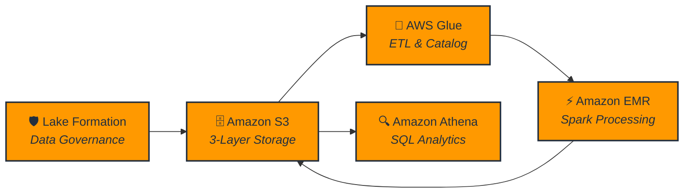
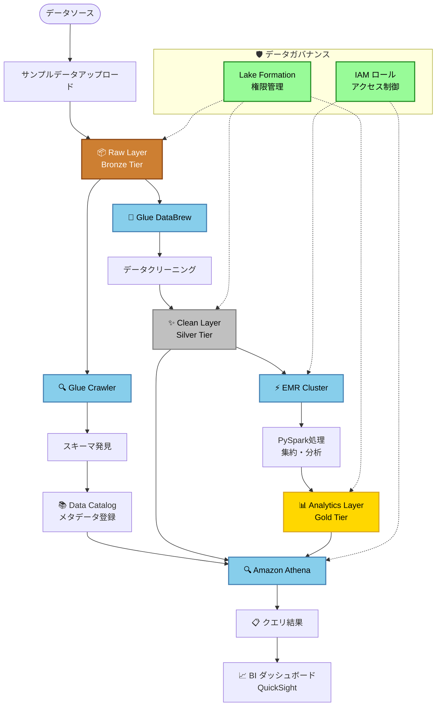

# AWS データレイク総合実践プロジェクト

## プロジェクト概要
本プロジェクトは、AWSクラウドサービスを基盤としたエンタープライズレベルのデータレイクプラットフォームをゼロから構築するためのものです。多層アーキテクチャ設計（Raw → Clean → Analytics）により、データ保存、ガバナンス、変換、分析の完全なデータ処理パイプラインをカバーしています。

プロジェクトは設定駆動方式を採用し、完全なスクリプト、テンプレート、サンプルデータを提供することで、学習者が企業レベルのデータレイクのベストプラクティスを迅速にデプロイし理解できるようになると思います。

## 技術アーキテクチャ

### コアサービススタック
- **ストレージ層**: Amazon S3 (階層ストレージ + ライフサイクル管理)
- **データガバナンス**: AWS Lake Formation (権限制御 + メタデータ管理)
- **ETLエンジン**: AWS Glue (Crawler + DataBrew + ETL Jobs)
- **計算エンジン**: Amazon EMR (Spark分散計算)
- **分析エンジン**: Amazon Athena (サーバーレス SQL クエリ)

### システムアーキテクチャ概要



### データフロー詳細図



### 権限とガバナンスモデル
- **Lake Formation**: 統一されたデータカタログと細かい権限制御
- **IAMロール**: 職責ベースの権限分離（DataEngineer、Analyst等）
- **クロスサービス統合**: EMR、Glue、Athenaのシームレスな権限継承

## プロジェクト構造

```
Datalake/
├── configs/                    # 設定管理
│   ├── config.env             # メイン設定ファイル（テンプレート）
│   ├── config.local.env       # ローカル設定オーバーライド（オプション）
│   └── env-vars.sh            # 環境変数（自動生成）
├── scripts/                   # 自動化スクリプト
│   ├── setup-env.sh          # 環境初期化
│   ├── cleanup.sh            # リソース清理
│   ├── create-emr-cluster.sh # EMRクラスター作成
│   ├── cost-optimization.sh  # コスト最適化
│   ├── submit_pyspark_job.sh # Sparkジョブ送信
│   ├── pyspark_analytics.py  # PySparkアナリティクススクリプト
│   └── athena_queries.sql    # Athena クエリサンプル
├── templates/                 # CloudFormation テンプレート
│   ├── s3-storage-layer.yaml      # S3 ストレージ層
│   ├── iam-roles-policies.yaml    # IAM ロール権限
│   ├── lake-formation.yaml        # Lake Formation 設定
│   └── cost-monitoring.yaml       # コスト監視
└── sample-data/               # サンプルデータセット
    ├── customers.csv          # 顧客データ
    ├── orders.csv            # 注文データ
    ├── order_items.csv       # 注文明細
    └── products.csv          # 製品データ
```

## コア機能

### 1. 設定駆動アーキテクチャ
- **統合設定**: `configs/config.env` ですべてのAWSリソース設定を集中管理
- **環境分離**: ローカル設定オーバーライド（`config.local.env`）をサポート
- **自動化**: スクリプトが環境変数ファイルを自動生成
- **命名規約**: 統一されたリソース命名規約（`${PROJECT_PREFIX}-${SUFFIX}`）

### 2. Infrastructure as Code
- **CloudFormation テンプレート**: 完全なIaC実装
- **モジュラー設計**: 機能別に分離されたテンプレートファイル
- **バージョン管理**: インフラストラクチャの変更が追跡可能
- **再現可能デプロイ**: 複数環境でのデプロイメントをサポート

### 3. セキュリティとガバナンス
- **最小権限原則**: ロールベースの詳細な権限制御
- **データ暗号化**: S3と転送プロセスのエンドツーエンド暗号化
- **監査ログ**: CloudTrail統合、完全な操作監査
- **列レベル権限**: Lake Formationの細かいデータアクセス制御

### 4. コスト最適化
- **自動クリーンアップ**: 完全なリソースクリーンアップスクリプト（オプションコンポーネント検出サポート）
- **ライフサイクル管理**: S3オブジェクトの自動アーカイブと削除
- **オンデマンド計算**: EMRクラスターのオンデマンド起動停止（Spotインスタンスサポート）
- **コスト監視**: CloudWatchコスト警告と予算アラート

### 5. サンプルデータセット
Eコマースシナリオの完全なデータセットを提供：
- **customers.csv**: 顧客基本情報
- **products.csv**: 製品カタログデータ
- **orders.csv**: 注文メインテーブル
- **order_items.csv**: 注文詳細テーブル

## 実験手順

### フェーズ1: 環境準備
1. AWSアカウント設定と権限設定
2. ローカル環境設定（AWS CLI、Python等）
3. プロジェクト設定ファイルのカスタマイズ

### フェーズ2: インフラストラクチャデプロイ
1. S3ストレージ層作成（Raw/Clean/Analytics三層）
2. IAMロールと権限ポリシーのデプロイ
3. Lake Formation初期化と権限設定

### フェーズ3: データ取り込みと発見
1. サンプルデータをRaw層にアップロード
2. Glue Crawlerによる自動Schema発見
3. Data Catalogメタデータ検証

### フェーズ4: データクリーニングと変換
1. Glue DataBrewビジュアルデータ準備
2. データクリーニングルール設計と実行
3. Clean層データ品質検証

### フェーズ5: データ分析と計算
1. EMRクラスター起動と設定（create-emr-cluster.shスクリプトを使用）
2. PySparkバッチデータ処理
3. Analytics層集約データ生成

### フェーズ6: インタラクティブ分析
1. Athenaデータソース設定
2. SQLクエリとパフォーマンス最適化
3. クエリ結果分析と可視化

### フェーズ7: 監視と最適化
1. コスト監視と最適化
2. パフォーマンスチューニングとトラブルシューティング
3. リソースクリーンアップと環境復旧

## 学習目標

本プロジェクト完了後、学習者は以下を習得できます：

### 技術スキル
- AWSデータレイクサービスの完全な使用方法
- Infrastructure as Codeのベストプラクティス
- ビッグデータETLパイプライン設計
- 分散計算とSQL分析
- データガバナンスと権限管理

### アーキテクチャ能力
- 企業レベルデータレイクアーキテクチャ設計
- 多層データストレージ戦略
- セキュリティとコンプライアンスアーキテクチャ
- コスト最適化戦略

### 運用スキル
- 自動化デプロイメントと運用
- 監視とトラブルシューティング
- パフォーマンスチューニングと最適化
- リソースライフサイクル管理

## 前提条件

### 技術準備
- 有効なAWSアカウント（管理者権限を持つ）
- ローカルにAWS CLIをインストールし認証情報を設定
- Python 3.7+環境
- SQLとPythonプログラミングの基礎能力

### 知識要件
- AWS基本サービスの理解（IAM、VPC、CloudWatch）
- データベースとデータウェアハウスの基本概念
- 分散計算の基礎理解
- クラウドセキュリティと権限管理の概念

## 予想時間とコスト

### 時間スケジュール
- **合計**: 3-4時間（経験レベルによる）
- **環境準備**: 30分
- **インフラストラクチャデプロイ**: 45分
- **データ処理プロセス**: 90分
- **分析と最適化**: 45分
- **クリーンアップ**: 15分

### コスト見積もり
主要課金コンポーネント：
- **S3ストレージ**: $0.023/GB/月（標準ストレージ）
- **EMRクラスター**: $0.067/時間（m5.xlarge）
- **Glue**: $0.44/DPU/時間
- **Athena**: $5/TBスキャンデータ
- **Lake Formation**: 追加料金なし

> **コスト制御ヒント**: EMRクラスターを適時停止することで実験コストを大幅に削減できます

## クイックスタート

1. AWS環境を設定します：
   ```bash
   ./scripts/setup-env.sh
   ```

2. データ処理用EMRクラスターを作成します：
   ```bash
   ./scripts/create-emr-cluster.sh --key-name <your-key> --subnet-id <your-subnet>
   ```

3. 完了後にリソースをクリーンアップします：
   ```bash
   ./scripts/cleanup.sh
   ```

## 拡張学習

### 上級トピック
- サーバーレスデータ処理（Lambda + Kinesis）
- リアルタイムストリーム処理（Kinesis Analytics）
- 機械学習統合（SageMaker）
- データ可視化（QuickSight）

### 企業レベル拡張
- マルチアカウントデータレイクアーキテクチャ
- データ系譜とインパクト分析
- 自動化データ品質チェック
- 災害復旧とバックアップ戦略

## ライセンス

本プロジェクトは教育・学習目的のみに使用してください。本番環境での直接使用は推奨されません。実際の使用前に十分なセキュリティ評価とテストを実施してください。

---

> **重要な注意**: 実験完了後は必ずクリーンアップスクリプトを実行し、不要なAWS料金の発生を避けてください。