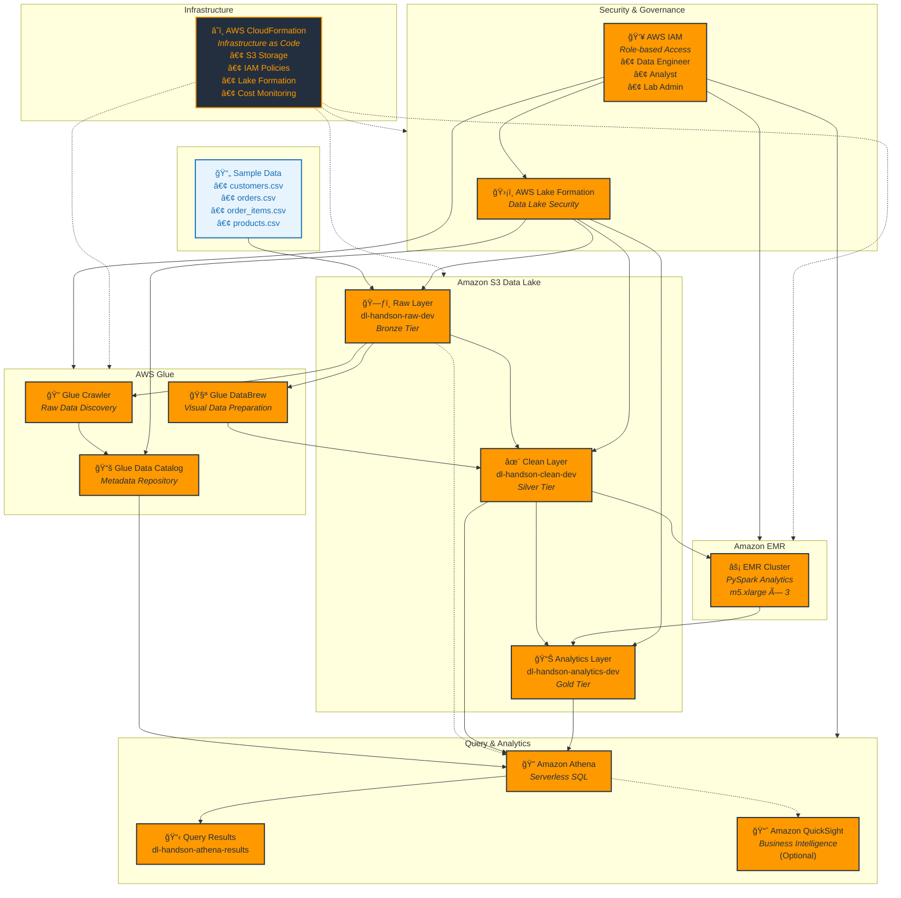

# AWS データレイクç·åˆå®Ÿè·µãƒ—ロジェクト

## プロジェクト概è¦
本プロジェクトã¯ã€AWSクラウドサービスを基盤ã¨ã—ãŸç¾ä»£çš„ãªãƒ‡ãƒ¼ã‚¿ãƒ¬ã‚¤ã‚¯ãƒ—ラットフォームをゼロã‹ã‚‰æ§‹ç¯‰ã™ã‚‹ãŸã‚ã®å®Œå…¨ãªAWSデータレイク教育実験ã§ã™ã€‚多層アーキテクãƒãƒ£è¨­è¨ˆï¼ˆRaw → Clean → Analytics）ã«ã‚ˆã‚Šã€ãƒ‡ãƒ¼ã‚¿ä¿å­˜ã€ã‚¬ãƒãƒŠãƒ³ã‚¹ã€å¤‰æ›ã€åˆ†æã®å®Œå…¨ãªãƒ‡ãƒ¼ã‚¿å‡¦ç†ãƒ‘イプラインをカãƒãƒ¼ã—ã¦ã„ã¾ã™ã€‚

プロジェクトã¯è¨­å®šé§†å‹•æ–¹å¼ã‚’æ¡ç”¨ã—ã€å®Œå…¨ãªã‚¹ã‚¯ãƒªãƒ—トã€ãƒ†ãƒ³ãƒ—レートã€ã‚µãƒ³ãƒ—ルデータをæä¾›ã™ã‚‹ã“ã¨ã§ã€å­¦ç¿’者ãŒä¼æ¥­ãƒ¬ãƒ™ãƒ«ã®ãƒ‡ãƒ¼ã‚¿ãƒ¬ã‚¤ã‚¯ã®ãƒ™ã‚¹ãƒˆãƒ—ラクティスを迅速ã«ãƒ‡ãƒ—ロイã—ç†è§£ã§ãるよã†ã«ãªã£ã¦ã„ã¾ã™ã€‚

## 技術アーキテクãƒãƒ£

### コアサービススタック
- **ストレージ層**: Amazon S3 (éšå±¤ã‚¹ãƒˆãƒ¬ãƒ¼ã‚¸ + ライフサイクル管ç†)
- **データガãƒãƒŠãƒ³ã‚¹**: AWS Lake Formation (権é™åˆ¶å¾¡ + メタデータ管ç†)
- **ETLエンジン**: AWS Glue (Crawler + DataBrew + ETL Jobs)
- **計算エンジン**: Amazon EMR (Spark分散計算)
- **分æエンジン**: Amazon Athena (サーãƒãƒ¼ãƒ¬ã‚¹ SQL クエリ)

### 三層データレイクアーキテクãƒãƒ£


```mermaid
graph TB
    %% Data Sources
    subgraph DataSources[" "]
        SD["📄 Sample Data<br/>• customers.csv<br/>• orders.csv<br/>• order_items.csv<br/>• products.csv"]
    end

    %% Data Lake Storage Layers
    subgraph DataLake["Amazon S3 Data Lake"]
        direction TB
        Raw["ğŸ—ƒï¸ Raw Layer<br/>dl-handson-raw-dev<br/><i>Bronze Tier</i>"]
        Clean["✨ Clean Layer<br/>dl-handson-clean-dev<br/><i>Silver Tier</i>"]
        Analytics["📊 Analytics Layer<br/>dl-handson-analytics-dev<br/><i>Gold Tier</i>"]
        
        Raw --> Clean
        Clean --> Analytics
    end

    %% Processing & ETL Services
    subgraph AWSGlue["AWS Glue"]
        Crawler1["🔠Glue Crawler<br/><i>Raw Data Discovery</i>"]
        DataBrew["🧪 Glue DataBrew<br/><i>Visual Data Preparation</i>"]
        Catalog["📚 Glue Data Catalog<br/><i>Metadata Repository</i>"]
    end

    subgraph EMR["Amazon EMR"]
        EMRCluster["⚡ EMR Cluster<br/><i>PySpark Analytics<br/>m5.xlarge × 3</i>"]
    end

    %% Analytics & Query Services
    subgraph QueryServices["Query & Analytics"]
        Athena["🔠Amazon Athena<br/><i>Serverless SQL</i>"]
        AthenaResults["📋 Query Results<br/>dl-handson-athena-results"]
        QuickSight["📈 Amazon QuickSight<br/><i>Business Intelligence</i><br/>(Optional)"]
    end

    %% Security & Governance
    subgraph Security["Security & Governance"]
        LakeFormation["ğŸ›¡ï¸ AWS Lake Formation<br/><i>Data Lake Security</i>"]
        IAM["👥 AWS IAM<br/><i>Role-based Access</i><br/>• Data Engineer<br/>• Analyst<br/>• Lab Admin"]
    end

    %% Infrastructure as Code
    subgraph IaC["Infrastructure"]
        CloudFormation["â˜ï¸ AWS CloudFormation<br/><i>Infrastructure as Code</i><br/>• S3 Storage<br/>• IAM Policies<br/>• Lake Formation<br/>• Cost Monitoring"]
    end

    %% Data Flow Connections
    SD --> Raw
    Raw --> Crawler1
    Raw --> DataBrew
    Crawler1 --> Catalog
    DataBrew --> Clean
    Clean --> EMRCluster
    EMRCluster --> Analytics
    
    %% Query Connections
    Catalog --> Athena
    Raw -.-> Athena
    Clean --> Athena
    Analytics --> Athena
    Athena --> AthenaResults
    Athena -.-> QuickSight

    %% Governance Connections
    LakeFormation --> Catalog
    LakeFormation --> Raw
    LakeFormation --> Clean
    LakeFormation --> Analytics
    IAM --> LakeFormation
    IAM --> AWSGlue
    IAM --> EMR
    IAM --> QueryServices

    %% Infrastructure Connections
    CloudFormation -.-> DataLake
    CloudFormation -.-> Security
    CloudFormation -.-> AWSGlue
    CloudFormation -.-> EMR

    %% AWS Official Color Scheme
    classDef s3 fill:#FF9900,stroke:#232F3E,stroke-width:2px,color:#232F3E
    classDef glue fill:#FF9900,stroke:#232F3E,stroke-width:2px,color:#232F3E
    classDef emr fill:#FF9900,stroke:#232F3E,stroke-width:2px,color:#232F3E
    classDef analytics fill:#FF9900,stroke:#232F3E,stroke-width:2px,color:#232F3E
    classDef security fill:#FF9900,stroke:#232F3E,stroke-width:2px,color:#232F3E
    classDef infra fill:#232F3E,stroke:#FF9900,stroke-width:2px,color:#FF9900
    classDef data fill:#E8F4FD,stroke:#146EB4,stroke-width:2px,color:#146EB4

    %% Apply Styles
    class Raw,Clean,Analytics,AthenaResults s3
    class Crawler1,DataBrew,Catalog glue
    class EMRCluster emr
    class Athena,QuickSight analytics
    class LakeFormation,IAM security
    class CloudFormation infra
    class SD data
```

### 権é™ã¨ã‚¬ãƒãƒŠãƒ³ã‚¹ãƒ¢ãƒ‡ãƒ«
- **Lake Formation**: 統一ã•ã‚ŒãŸãƒ‡ãƒ¼ã‚¿ã‚«ã‚¿ãƒ­ã‚°ã¨ç´°ã‹ã„権é™åˆ¶å¾¡
- **IAMロール**: è·è²¬ãƒ™ãƒ¼ã‚¹ã®æ¨©é™åˆ†é›¢ï¼ˆDataEngineerã€Analyst等）
- **クロスサービス統åˆ**: EMRã€Glueã€Athenaã®ã‚·ãƒ¼ãƒ ãƒ¬ã‚¹ãªæ¨©é™ç¶™æ‰¿

## プロジェクト構造

```
Datalake/
├── configs/                    # 設定管ç†
│   ├── config.env             # メイン設定ファイル（テンプレート）
│   ├── config.local.env       # ローカル設定オーãƒãƒ¼ãƒ©ã‚¤ãƒ‰ï¼ˆã‚ªãƒ—ション）
│   └── env-vars.sh            # 環境変数（自動生æˆï¼‰
├── scripts/                   # 自動化スクリプト
│   ├── setup-env.sh          # 環境åˆæœŸåŒ–
│   ├── cleanup.sh            # リソース清ç†
│   ├── create-emr-cluster.sh # EMRクラスター作æˆ
│   ├── cost-optimization.sh  # コスト最é©åŒ–
│   ├── submit_pyspark_job.sh # Sparkジョブé€ä¿¡
│   ├── pyspark_analytics.py  # PySparkアナリティクススクリプト
│   └── athena_queries.sql    # Athena クエリサンプル
├── templates/                 # CloudFormation テンプレート
│   ├── s3-storage-layer.yaml      # S3 ストレージ層
│   ├── iam-roles-policies.yaml    # IAM ロール権é™
│   ├── lake-formation.yaml        # Lake Formation 設定
│   └── cost-monitoring.yaml       # コスト監視
└── sample-data/               # サンプルデータセット
    ├── customers.csv          # 顧客データ
    ├── orders.csv            # 注文データ
    ├── order_items.csv       # 注文æ˜ç´°
    └── products.csv          # 製å“データ
```

## コア機能

### 1. 設定駆動アーキテクãƒãƒ£
- **çµ±åˆè¨­å®š**: `configs/config.env` ã§ã™ã¹ã¦ã®AWSリソース設定を集中管ç†
- **環境分離**: ローカル設定オーãƒãƒ¼ãƒ©ã‚¤ãƒ‰ï¼ˆ`config.local.env`）をサãƒãƒ¼ãƒˆ
- **自動化**: スクリプトãŒç’°å¢ƒå¤‰æ•°ãƒ•ã‚¡ã‚¤ãƒ«ã‚’自動生æˆ
- **命åè¦ç´„**: 統一ã•ã‚ŒãŸãƒªã‚½ãƒ¼ã‚¹å‘½åè¦ç´„（`${PROJECT_PREFIX}-${SUFFIX}`）

### 2. Infrastructure as Code
- **CloudFormation テンプレート**: 完全ãªIaC実装
- **モジュラー設計**: 機能別ã«åˆ†é›¢ã•ã‚ŒãŸãƒ†ãƒ³ãƒ—レートファイル
- **ãƒãƒ¼ã‚¸ãƒ§ãƒ³ç®¡ç†**: インフラストラクãƒãƒ£ã®å¤‰æ›´ãŒè¿½è·¡å¯èƒ½
- **å†ç¾å¯èƒ½ãƒ‡ãƒ—ロイ**: 複数環境ã§ã®ãƒ‡ãƒ—ロイメントをサãƒãƒ¼ãƒˆ

### 3. セキュリティã¨ã‚¬ãƒãƒŠãƒ³ã‚¹
- **最å°æ¨©é™åŸå‰‡**: ロールベースã®è©³ç´°ãªæ¨©é™åˆ¶å¾¡
- **データ暗å·åŒ–**: S3ã¨è»¢é€ãƒ—ロセスã®ã‚¨ãƒ³ãƒ‰ãƒ„ーエンド暗å·åŒ–
- **監査ログ**: CloudTrailçµ±åˆã€å®Œå…¨ãªæ“作監査
- **列レベル権é™**: Lake Formationã®ç´°ã‹ã„データアクセス制御

### 4. コスト最é©åŒ–
- **自動クリーンアップ**: 完全ãªãƒªã‚½ãƒ¼ã‚¹ã‚¯ãƒªãƒ¼ãƒ³ã‚¢ãƒƒãƒ—スクリプト（オプションコンãƒãƒ¼ãƒãƒ³ãƒˆæ¤œå‡ºã‚µãƒãƒ¼ãƒˆï¼‰
- **ライフサイクル管ç†**: S3オブジェクトã®è‡ªå‹•ã‚¢ãƒ¼ã‚«ã‚¤ãƒ–ã¨å‰Šé™¤
- **オンデãƒãƒ³ãƒ‰è¨ˆç®—**: EMRクラスターã®ã‚ªãƒ³ãƒ‡ãƒãƒ³ãƒ‰èµ·å‹•åœæ­¢ï¼ˆSpotインスタンスサãƒãƒ¼ãƒˆï¼‰
- **コスト監視**: CloudWatchコスト警告ã¨äºˆç®—アラート

### 5. サンプルデータセット
Eコãƒãƒ¼ã‚¹ã‚·ãƒŠãƒªã‚ªã®å®Œå…¨ãªãƒ‡ãƒ¼ã‚¿ã‚»ãƒƒãƒˆã‚’æ供：
- **customers.csv**: 顧客基本情報
- **products.csv**: 製å“カタログデータ
- **orders.csv**: 注文メインテーブル
- **order_items.csv**: 注文詳細テーブル

## 実験手順

### フェーズ1: 環境準備
1. AWSアカウント設定ã¨æ¨©é™è¨­å®š
2. ローカル環境設定（AWS CLIã€Python等）
3. プロジェクト設定ファイルã®ã‚«ã‚¹ã‚¿ãƒã‚¤ã‚º

### フェーズ2: インフラストラクãƒãƒ£ãƒ‡ãƒ—ロイ
1. S3ストレージ層作æˆï¼ˆRaw/Clean/Analytics三層）
2. IAMロールã¨æ¨©é™ãƒãƒªã‚·ãƒ¼ã®ãƒ‡ãƒ—ロイ
3. Lake FormationåˆæœŸåŒ–ã¨æ¨©é™è¨­å®š

### フェーズ3: データå–ã‚Šè¾¼ã¿ã¨ç™ºè¦‹
1. サンプルデータをRaw層ã«ã‚¢ãƒƒãƒ—ロード
2. Glue Crawlerã«ã‚ˆã‚‹è‡ªå‹•Schema発見
3. Data Catalogメタデータ検証

### フェーズ4: データクリーニングã¨å¤‰æ›
1. Glue DataBrewビジュアルデータ準備
2. データクリーニングルール設計ã¨å®Ÿè¡Œ
3. Clean層データå“質検証

### フェーズ5: データ分æã¨è¨ˆç®—
1. EMRクラスター起動ã¨è¨­å®šï¼ˆcreate-emr-cluster.shスクリプトを使用）
2. PySparkãƒãƒƒãƒãƒ‡ãƒ¼ã‚¿å‡¦ç†
3. Analytics層集約データ生æˆ

### フェーズ6: インタラクティブ分æ
1. Athenaデータソース設定
2. SQLクエリã¨ãƒ‘フォーãƒãƒ³ã‚¹æœ€é©åŒ–
3. クエリçµæœåˆ†æã¨å¯è¦–化

### フェーズ7: 監視ã¨æœ€é©åŒ–
1. コスト監視ã¨æœ€é©åŒ–
2. パフォーãƒãƒ³ã‚¹ãƒãƒ¥ãƒ¼ãƒ‹ãƒ³ã‚°ã¨ãƒˆãƒ©ãƒ–ルシューティング
3. リソースクリーンアップã¨ç’°å¢ƒå¾©æ—§

## 学習目標

本プロジェクト完了後ã€å­¦ç¿’者ã¯ä»¥ä¸‹ã‚’ç¿’å¾—ã§ãã¾ã™ï¼š

### 技術スキル
- AWSデータレイクサービスã®å®Œå…¨ãªä½¿ç”¨æ–¹æ³•
- Infrastructure as Codeã®ãƒ™ã‚¹ãƒˆãƒ—ラクティス
- ビッグデータETLパイプライン設計
- 分散計算ã¨SQL分æ
- データガãƒãƒŠãƒ³ã‚¹ã¨æ¨©é™ç®¡ç†

### アーキテクãƒãƒ£èƒ½åŠ›
- ä¼æ¥­ãƒ¬ãƒ™ãƒ«ãƒ‡ãƒ¼ã‚¿ãƒ¬ã‚¤ã‚¯ã‚¢ãƒ¼ã‚­ãƒ†ã‚¯ãƒãƒ£è¨­è¨ˆ
- 多層データストレージ戦略
- セキュリティã¨ã‚³ãƒ³ãƒ—ライアンスアーキテクãƒãƒ£
- コスト最é©åŒ–戦略

### é‹ç”¨ã‚¹ã‚­ãƒ«
- 自動化デプロイメントã¨é‹ç”¨
- 監視ã¨ãƒˆãƒ©ãƒ–ルシューティング
- パフォーãƒãƒ³ã‚¹ãƒãƒ¥ãƒ¼ãƒ‹ãƒ³ã‚°ã¨æœ€é©åŒ–
- リソースライフサイクル管ç†

## å‰ææ¡ä»¶

### 技術準備
- 有効ãªAWSアカウント（管ç†è€…権é™ã‚’æŒã¤ï¼‰
- ローカルã«AWS CLIをインストールã—èªè¨¼æƒ…報を設定
- Python 3.7+環境
- SQLã¨Pythonプログラミングã®åŸºç¤èƒ½åŠ›

### 知識è¦ä»¶
- AWS基本サービスã®ç†è§£ï¼ˆIAMã€VPCã€CloudWatch）
- データベースã¨ãƒ‡ãƒ¼ã‚¿ã‚¦ã‚§ã‚¢ãƒã‚¦ã‚¹ã®åŸºæœ¬æ¦‚念
- 分散計算ã®åŸºç¤ç†è§£
- クラウドセキュリティã¨æ¨©é™ç®¡ç†ã®æ¦‚念

## 予想時間ã¨ã‚³ã‚¹ãƒˆ

### 時間スケジュール
- **åˆè¨ˆ**: 3-4時間（経験レベルã«ã‚ˆã‚‹ï¼‰
- **環境準備**: 30分
- **インフラストラクãƒãƒ£ãƒ‡ãƒ—ロイ**: 45分
- **データ処ç†ãƒ—ロセス**: 90分
- **分æã¨æœ€é©åŒ–**: 45分
- **クリーンアップ**: 15分

### コスト見ç©ã‚‚ã‚Š
主è¦èª²é‡‘コンãƒãƒ¼ãƒãƒ³ãƒˆï¼š
- **S3ストレージ**: $0.023/GB/月（標準ストレージ）
- **EMRクラスター**: $0.067/時間（m5.xlarge）
- **Glue**: $0.44/DPU/時間
- **Athena**: $5/TBスキャンデータ
- **Lake Formation**: 追加料金ãªã—

> **コスト制御ヒント**: EMRクラスターをé©æ™‚åœæ­¢ã™ã‚‹ã“ã¨ã§å®Ÿé¨“コストを大幅ã«å‰Šæ¸›ã§ãã¾ã™

## クイックスタート

1. AWS環境を設定ã—ã¾ã™ï¼š
   ```bash
   ./scripts/setup-env.sh
   ```

2. データ処ç†ç”¨EMRクラスターを作æˆã—ã¾ã™ï¼š
   ```bash
   ./scripts/create-emr-cluster.sh --key-name <your-key> --subnet-id <your-subnet>
   ```

3. 完了後ã«ãƒªã‚½ãƒ¼ã‚¹ã‚’クリーンアップã—ã¾ã™ï¼š
   ```bash
   ./scripts/cleanup.sh
   ```

## 拡張学習

### 上級トピック
- サーãƒãƒ¼ãƒ¬ã‚¹ãƒ‡ãƒ¼ã‚¿å‡¦ç†ï¼ˆLambda + Kinesis）
- リアルタイムストリーム処ç†ï¼ˆKinesis Analytics）
- 機械学習統åˆï¼ˆSageMaker）
- データå¯è¦–化（QuickSight）

### ä¼æ¥­ãƒ¬ãƒ™ãƒ«æ‹¡å¼µ
- ãƒãƒ«ãƒã‚¢ã‚«ã‚¦ãƒ³ãƒˆãƒ‡ãƒ¼ã‚¿ãƒ¬ã‚¤ã‚¯ã‚¢ãƒ¼ã‚­ãƒ†ã‚¯ãƒãƒ£
- データ系譜ã¨ã‚¤ãƒ³ãƒ‘クト分æ
- 自動化データå“質ãƒã‚§ãƒƒã‚¯
- ç½å®³å¾©æ—§ã¨ãƒãƒƒã‚¯ã‚¢ãƒƒãƒ—戦略

## ライセンス

本プロジェクトã¯æ•™è‚²ãƒ»å­¦ç¿’目的ã®ã¿ã«ä½¿ç”¨ã—ã¦ãã ã•ã„。本番環境ã§ã®ç›´æ¥ä½¿ç”¨ã¯æ¨å¥¨ã•ã‚Œã¾ã›ã‚“。実際ã®ä½¿ç”¨å‰ã«å分ãªã‚»ã‚­ãƒ¥ãƒªãƒ†ã‚£è©•ä¾¡ã¨ãƒ†ã‚¹ãƒˆã‚’実施ã—ã¦ãã ã•ã„。

---

> **é‡è¦ãªæ³¨æ„**: 実験完了後ã¯å¿…ãšã‚¯ãƒªãƒ¼ãƒ³ã‚¢ãƒƒãƒ—スクリプトを実行ã—ã€ä¸è¦ãªAWS料金ã®ç™ºç”Ÿã‚’é¿ã‘ã¦ãã ã•ã„。