# AWS データレイク総合実践プロジェクト

## プロジェクト概要
本プロジェクトは、AWSクラウドサービスを基盤としたエンタープライズレベルのデータレイクプラットフォームをゼロから構築するためのものです。多層アーキテクチャ設計（Raw → Clean → Analytics）により、データ保存、ガバナンス、変換、分析の完全なデータ処理パイプラインをカバーしています。

プロジェクトは設定駆動方式を採用し、完全なスクリプト、テンプレート、サンプルデータを提供することで、学習者が企業レベルのデータレイクのベストプラクティスを迅速にデプロイし理解できるようになると思います。


## 目次
- [プロジェクト概要](#プロジェクト概要)
- [技術アーキテクチャ](#技術アーキテクチャ)
- [システムアーキテクチャ概要](#システムアーキテクチャ概要)
- [権限とガバナンスモデル](#権限とガバナンスモデル)
- [プロジェクト構造](#プロジェクト構造)
- [コア機能](#コア機能)
- [実験手順](#実験手順)
- [前提条件](#前提条件)
- [予想時間とコスト](#予想時間とコスト)
- [クイックスタート](#クイックスタート)
- [ステップバイステップデプロイガイド](#ステップバイステップデプロイガイド)
  - [デプロイ準備](#デプロイ準備)
  - [基盤インフラストラクチャのデプロイ](#基盤インフラストラクチャのデプロイ)
  - [データレイク階層の構築](#データレイク階層の構築)
  - [データ処理環境の設定](#データ処理環境の設定)
  - [分析環境の構成](#分析環境の構成)
  - [検証とテスト](#検証とテスト)
  - [クリーンアップと最適化](#クリーンアップと最適化)
- [拡張学習](#拡張学習)
- [ライセンス](#ライセンス)

## 技術アーキテクチャ

### コアサービススタック
- **ストレージ層**: Amazon S3 (階層ストレージ + ライフサイクル管理)
- **データガバナンス**: AWS Lake Formation (権限制御 + メタデータ管理)
- **ETLエンジン**: AWS Glue (Crawler + DataBrew + ETL Jobs)
- **計算エンジン**: Amazon EMR (Spark分散計算)
- **分析エンジン**: Amazon Athena (サーバーレス SQL クエリ)

### システムアーキテクチャ概要


### データフロー詳細図

```mermaid
flowchart TD
    %% Data Sources
    Start([データソース]) --> Upload[サンプルデータアップロード]
    Upload --> RawBucket[📦 Raw Layer<br/>Bronze Tier]

    %% Discovery Phase
    RawBucket --> Crawler[🔍 Glue Crawler]
    Crawler --> Schema[スキーマ発見]
    Schema --> Catalog[📚 Data Catalog<br/>メタデータ登録]

    %% Cleaning Phase  
    RawBucket --> DataBrew[🧪 Glue DataBrew]
    DataBrew --> Clean[データクリーニング]
    Clean --> CleanBucket[✨ Clean Layer<br/>Silver Tier]

    %% Analytics Phase
    CleanBucket --> EMR[⚡ EMR Cluster]
    EMR --> Process[PySpark処理<br/>集約・分析]
    Process --> AnalyticsBucket[📊 Analytics Layer<br/>Gold Tier]

    %% Query Phase
    Catalog --> Athena[🔍 Amazon Athena]
    CleanBucket --> Athena
    AnalyticsBucket --> Athena
    Athena --> Results[📋 クエリ結果]
    
    %% Business Intelligence
    Results --> BI[📈 BI ダッシュボード<br/>QuickSight]

    %% Governance Layer
    subgraph Governance[🛡️ データガバナンス]
        LakeFormation[Lake Formation<br/>権限管理]
        IAM[IAM ロール<br/>アクセス制御]
    end
    
    LakeFormation -.-> RawBucket
    LakeFormation -.-> CleanBucket  
    LakeFormation -.-> AnalyticsBucket
    IAM -.-> EMR
    IAM -.-> Athena

    %% Processing Phases
    classDef bronze fill:#CD7F32,stroke:#8B4513,stroke-width:2px,color:white
    classDef silver fill:#C0C0C0,stroke:#808080,stroke-width:2px,color:#000
    classDef gold fill:#FFD700,stroke:#DAA520,stroke-width:2px,color:#000
    classDef process fill:#87CEEB,stroke:#4682B4,stroke-width:2px,color:#000
    classDef governance fill:#98FB98,stroke:#228B22,stroke-width:2px,color:#000

    class RawBucket bronze
    class CleanBucket silver
    class AnalyticsBucket gold
    class Crawler,DataBrew,EMR,Athena process
    class LakeFormation,IAM governance
```



### 権限とガバナンスモデル
- **Lake Formation**: 統一されたデータカタログと細かい権限制御
- **IAMロール**: 職責ベースの権限分離（DataEngineer、Analyst等）
- **クロスサービス統合**: EMR、Glue、Athenaのシームレスな権限継承

## プロジェクト構造

```
Datalake/
├── configs/                    # 設定管理
│   ├── config.env             # メイン設定ファイル（テンプレート）
│   ├── config.local.env       # ローカル設定オーバーライド（オプション）
│   └── env-vars.sh            # 環境変数（自動生成）
├── scripts/                   # 自動化スクリプト
│   ├── setup-env.sh          # 環境初期化
│   ├── cleanup.sh            # リソース清理
│   ├── create-emr-cluster.sh # EMRクラスター作成
│   ├── cost-optimization.sh  # コスト最適化
│   ├── submit_pyspark_job.sh # Sparkジョブ送信
│   ├── pyspark_analytics.py  # PySparkアナリティクススクリプト
│   └── athena_queries.sql    # Athena クエリサンプル
├── templates/                 # CloudFormation テンプレート
│   ├── s3-storage-layer.yaml      # S3 ストレージ層
│   ├── iam-roles-policies.yaml    # IAM ロール権限
│   ├── lake-formation.yaml        # Lake Formation 設定
│   └── cost-monitoring.yaml       # コスト監視
└── sample-data/               # サンプルデータセット
    ├── customers.csv          # 顧客データ
    ├── orders.csv            # 注文データ
    ├── order_items.csv       # 注文明細
    └── products.csv          # 製品データ
```

## コア機能

### 1. 設定駆動アーキテクチャ
- **統合設定**: `configs/config.env` ですべてのAWSリソース設定を集中管理
- **環境分離**: ローカル設定オーバーライド（`config.local.env`）をサポート
- **自動化**: スクリプトが環境変数ファイルを自動生成
- **命名規約**: 統一されたリソース命名規約（`${PROJECT_PREFIX}-${SUFFIX}`）

### 2. Infrastructure as Code
- **CloudFormation テンプレート**: 完全なIaC実装
- **モジュラー設計**: 機能別に分離されたテンプレートファイル
- **バージョン管理**: インフラストラクチャの変更が追跡可能
- **再現可能デプロイ**: 複数環境でのデプロイメントをサポート

### 3. セキュリティとガバナンス
- **最小権限原則**: ロールベースの詳細な権限制御
- **データ暗号化**: S3と転送プロセスのエンドツーエンド暗号化
- **監査ログ**: CloudTrail統合、完全な操作監査
- **列レベル権限**: Lake Formationの細かいデータアクセス制御

### 4. コスト最適化
- **自動クリーンアップ**: 完全なリソースクリーンアップスクリプト（オプションコンポーネント検出サポート）
- **ライフサイクル管理**: S3オブジェクトの自動アーカイブと削除
- **オンデマンド計算**: EMRクラスターのオンデマンド起動停止（Spotインスタンスサポート）
- **コスト監視**: CloudWatchコスト警告と予算アラート

### 5. サンプルデータセット
Eコマースシナリオの完全なデータセットを提供：
- **customers.csv**: 顧客基本情報
- **products.csv**: 製品カタログデータ
- **orders.csv**: 注文メインテーブル
- **order_items.csv**: 注文詳細テーブル

## 実験手順

### フェーズ1: 環境準備
1. AWSアカウント設定と権限設定
2. ローカル環境設定（AWS CLI、Python等）
3. プロジェクト設定ファイルのカスタマイズ

### フェーズ2: インフラストラクチャデプロイ
1. S3ストレージ層作成（Raw/Clean/Analytics三層）
2. IAMロールと権限ポリシーのデプロイ
3. Lake Formation初期化と権限設定

### フェーズ3: データ取り込みと発見
1. サンプルデータをRaw層にアップロード
2. Glue Crawlerによる自動Schema発見
3. Data Catalogメタデータ検証

### フェーズ4: データクリーニングと変換
1. Glue DataBrewビジュアルデータ準備
2. データクリーニングルール設計と実行
3. Clean層データ品質検証

### フェーズ5: データ分析と計算
1. EMRクラスター起動と設定（create-emr-cluster.shスクリプトを使用）
2. PySparkバッチデータ処理
3. Analytics層集約データ生成

### フェーズ6: インタラクティブ分析
1. Athenaデータソース設定
2. SQLクエリとパフォーマンス最適化
3. クエリ結果分析と可視化

### フェーズ7: 監視と最適化
1. コスト監視と最適化
2. パフォーマンスチューニングとトラブルシューティング
3. リソースクリーンアップと環境復旧

## 前提条件

### 技術準備
- 有効なAWSアカウント（管理者権限を持つ）
- ローカルにAWS CLIをインストールし認証情報を設定
- Python 3.7+環境
- SQLとPythonプログラミングの基礎能力

### 知識要件
- AWS基本サービスの理解（IAM、VPC、CloudWatch）
- データベースとデータウェアハウスの基本概念
- 分散計算の基礎理解
- クラウドセキュリティと権限管理の概念

## 予想時間とコスト

### 時間スケジュール
- **合計**: 3-4時間（経験レベルによる）
- **環境準備**: 30分
- **インフラストラクチャデプロイ**: 45分
- **データ処理プロセス**: 90分
- **分析と最適化**: 45分
- **クリーンアップ**: 15分

### コスト見積もり
主要課金コンポーネント：
- **S3ストレージ**: $0.023/GB/月（標準ストレージ）
- **EMRクラスター**: $0.067/時間（m5.xlarge）
- **Glue**: $0.44/DPU/時間
- **Athena**: $5/TBスキャンデータ
- **Lake Formation**: 追加料金なし

> **コスト制御ヒント**: EMRクラスターを適時停止することで実験コストを大幅に削減できます

## クイックスタート

1. AWS環境を設定します：
   ```bash
   ./scripts/setup-env.sh
   ```

2. データ処理用EMRクラスターを作成します：
   ```bash
   ./scripts/create-emr-cluster.sh --key-name <your-key> --subnet-id <your-subnet>
   ```

3. 完了後にリソースをクリーンアップします：
   ```bash
   ./scripts/cleanup.sh
   ```

### 🔗 便利なリンク

デプロイ完了後にアクセスできるAWSコンソール：
- [S3管理コンソール](https://console.aws.amazon.com/s3/)
- [Glue管理コンソール](https://console.aws.amazon.com/glue/)
- [EMR管理コンソール](https://console.aws.amazon.com/elasticmapreduce/)
- [Athena管理コンソール](https://console.aws.amazon.com/athena/)
- [CloudFormation管理コンソール](https://console.aws.amazon.com/cloudformation/)
- [コスト管理コンソール](https://console.aws.amazon.com/billing/)

## ステップバイステップデプロイガイド

より詳細な制御と学習体験のため、以下のステップバイステップデプロイガイドを提供します。各ステップで実行内容を理解し、カスタマイズできます。

### デプロイ準備

#### 🔧 環境検証
```bash
# AWS認証情報を確認
aws sts get-caller-identity

# 必要な権限をテスト
aws iam list-roles --max-items 1

# リージョン設定を確認
aws configure get region
```

#### 📝 設定ファイルのカスタマイズ
```bash
# ローカル設定ファイルを作成
cp configs/config.env configs/config.local.env

# 必要に応じて以下の設定を編集：
# - AWS_REGION: デプロイ地域
# - PROJECT_PREFIX: プロジェクト名プレフィックス
# - ENVIRONMENT: 環境名（dev/staging/prod）
# - EMR_INSTANCE_TYPE: EMRインスタンスタイプ
vim configs/config.local.env
```

#### 🚨 コスト設定
```bash
# コスト監視用のメールアドレス設定
export EMAIL_ADDRESS="your-email@example.com"

# 予算と警告の閾値設定（オプション）
# configs/config.local.env で DAILY_BUDGET を設定
```

### 基盤インフラストラクチャのデプロイ

#### 1️⃣ S3ストレージ層の作成
```bash
# S3バケットとライフサイクルポリシーを作成
aws cloudformation deploy \
  --template-file templates/s3-storage-layer.yaml \
  --stack-name datalake-s3-storage-dev \
  --parameter-overrides \
    ProjectPrefix=dl-handson \
    Environment=dev \
  --region us-east-1

# 作成されたバケットを確認
aws s3 ls | grep dl-handson
```

#### 2️⃣ IAMロールとポリシーの設定
```bash
# データレイク用のIAMロールを作成
aws cloudformation deploy \
  --template-file templates/iam-roles-policies.yaml \
  --stack-name datalake-iam-roles-dev \
  --parameter-overrides \
    ProjectPrefix=dl-handson \
    Environment=dev \
    S3StackName=datalake-s3-storage-dev \
  --capabilities CAPABILITY_NAMED_IAM \
  --region us-east-1

# 作成されたロールを確認
aws iam list-roles --query "Roles[?contains(RoleName, 'dl-handson')].RoleName"
```

#### 3️⃣ Lake Formationの初期化
```bash
# Lake Formationデータガバナンスを設定
aws cloudformation deploy \
  --template-file templates/lake-formation.yaml \
  --stack-name datalake-lake-formation-dev \
  --parameter-overrides \
    ProjectPrefix=dl-handson \
    Environment=dev \
    S3StackName=datalake-s3-storage-dev \
    IAMStackName=datalake-iam-roles-dev \
  --region us-east-1

# Glueデータベースを確認
aws glue get-databases --region us-east-1
```

#### 4️⃣ コスト監視の設定（オプション）
```bash
# コストアラートとSNS通知を設定
aws cloudformation deploy \
  --template-file templates/cost-monitoring.yaml \
  --stack-name datalake-cost-monitoring-dev \
  --parameter-overrides \
    ProjectPrefix=dl-handson \
    Environment=dev \
    AlertEmail=$EMAIL_ADDRESS \
  --region us-east-1

# SNS購読確認メールをチェック
echo "メールボックスでSNS確認メールをチェックしてください"
```

### データレイク階層の構築

#### 🥉 Raw層：データ取り込み
```bash
# サンプルデータをRaw層にアップロード
aws s3 cp sample-data/customers.csv s3://dl-handson-raw-dev/ecommerce/customers/customers.csv
aws s3 cp sample-data/orders.csv s3://dl-handson-raw-dev/ecommerce/orders/orders.csv  
aws s3 cp sample-data/products.csv s3://dl-handson-raw-dev/ecommerce/products/products.csv
aws s3 cp sample-data/order_items.csv s3://dl-handson-raw-dev/ecommerce/order_items/order_items.csv

# アップロードを確認
aws s3 ls s3://dl-handson-raw-dev/ecommerce/ --recursive
```

#### 🔍 スキーマ発見とカタログ化
```bash
# Glue Crawlerを起動してスキーマを自動発見
aws glue start-crawler --name dl-handson-raw-crawler --region us-east-1

# Crawler実行状況を監視
watch -n 10 'aws glue get-crawler --name dl-handson-raw-crawler --region us-east-1 --query "Crawler.State"'

# 発見されたテーブルを確認
aws glue get-tables --database-name dl_handson_db --region us-east-1
```

#### 🥈 Clean層：データクリーニング（オプション）
```bash
# Glue DataBrewでデータクリーニングプロジェクトを作成
aws databrew create-project \
  --name dl-handson-cleaning-project \
  --dataset-name customers-dataset \
  --recipe-name cleaning-recipe \
  --role-arn arn:aws:iam::ACCOUNT:role/dl-handson-GlueDataBrewRole-dev

# データクリーニングジョブを実行
aws databrew start-job-run --name cleaning-job
```

### データ処理環境の設定

#### ⚡ EMRクラスターの作成
```bash
# EC2キーペアを取得（EMRアクセス用）
aws ec2 describe-key-pairs --region us-east-1

# サブネットIDを取得
aws ec2 describe-subnets --region us-east-1 --query "Subnets[0].SubnetId"

# EMRクラスターを作成（Spot instances使用でコスト削減）
./scripts/create-emr-cluster.sh \
  --key-name your-ec2-key-name \
  --subnet-id subnet-xxxxxxxxx \
  --use-spot \
  --auto-terminate

# クラスター状態を確認
aws emr list-clusters --region us-east-1 --active
```

#### 🐍 PySparkデータ処理
```bash
# PySpark分析ジョブをEMRに提出
./scripts/submit_pyspark_job.sh

# ジョブ実行状況を監視
aws emr list-steps --cluster-id j-XXXXXXXXX --region us-east-1

# 処理結果をClean層で確認
aws s3 ls s3://dl-handson-clean-dev/ --recursive
```

### 分析環境の構成

#### 🔍 Athenaクエリ環境の設定
```bash
# Athenaワークグループを設定
aws athena create-work-group \
  --name dl-handson-workgroup \
  --configuration ResultConfigurationUpdates={OutputLocation=s3://dl-handson-athena-results-dev/}

# データベースとテーブルを確認
aws athena start-query-execution \
  --query-string "SHOW DATABASES;" \
  --work-group dl-handson-workgroup \
  --result-configuration OutputLocation=s3://dl-handson-athena-results-dev/
```

#### 📊 サンプルクエリの実行
```sql
-- Athenaコンソールまたは以下のコマンドで実行

-- 1. 基本的なデータ確認
SELECT * FROM dl_handson_db.customers LIMIT 10;

-- 2. 注文統計分析
SELECT 
    EXTRACT(YEAR FROM order_date) as year,
    EXTRACT(MONTH FROM order_date) as month,
    COUNT(*) as order_count,
    SUM(total_amount) as total_sales
FROM dl_handson_db.orders 
GROUP BY EXTRACT(YEAR FROM order_date), EXTRACT(MONTH FROM order_date)
ORDER BY year, month;

-- 3. 顧客別購入分析
SELECT 
    c.customer_name,
    COUNT(o.order_id) as order_count,
    SUM(o.total_amount) as total_spent
FROM dl_handson_db.customers c
JOIN dl_handson_db.orders o ON c.customer_id = o.customer_id
GROUP BY c.customer_name
ORDER BY total_spent DESC
LIMIT 10;
```

### 検証とテスト

#### ✅ システム全体の動作確認
```bash
# 1. 全てのCloudFormationスタックを確認
aws cloudformation list-stacks --stack-status-filter CREATE_COMPLETE UPDATE_COMPLETE

# 2. S3バケットとデータを確認
aws s3 ls | grep dl-handson
aws s3 ls s3://dl-handson-raw-dev/ecommerce/ --recursive

# 3. Glueカタログを確認  
aws glue get-databases --region us-east-1
aws glue get-tables --database-name dl_handson_db --region us-east-1

# 4. EMRクラスター状態を確認
aws emr list-clusters --region us-east-1

# 5. 簡単なAthenaクエリをテスト
aws athena start-query-execution \
  --query-string "SELECT COUNT(*) FROM dl_handson_db.customers;" \
  --work-group primary \
  --result-configuration OutputLocation=s3://dl-handson-athena-results-dev/
```

#### 🧪 データ品質検証
```bash
# データカウントの確認
echo "=== データ品質チェック ==="
aws athena start-query-execution \
  --query-string "SELECT 'customers' as table_name, COUNT(*) as row_count FROM dl_handson_db.customers
                  UNION ALL  
                  SELECT 'orders' as table_name, COUNT(*) as row_count FROM dl_handson_db.orders
                  UNION ALL
                  SELECT 'products' as table_name, COUNT(*) as row_count FROM dl_handson_db.products;" \
  --work-group primary \
  --result-configuration OutputLocation=s3://dl-handson-athena-results-dev/
```

### クリーンアップと最適化

#### 🧹 段階的リソースクリーンアップ
```bash
# 1. EMRクラスターを終了（最高優先度 - コスト削減）
aws emr terminate-clusters --cluster-ids j-XXXXXXXXX

# 2. 一時的なGlueジョブとCrawlerを停止
aws glue stop-crawler --name dl-handson-raw-crawler
aws databrew delete-job --name cleaning-job

# 3. S3データを選択的に削除（必要に応じて）
aws s3 rm s3://dl-handson-raw-dev/temp/ --recursive
aws s3 rm s3://dl-handson-analytics-dev/temp/ --recursive

# 4. 完全クリーンアップ（全てのリソースを削除）
./scripts/cleanup.sh
```

#### 💰 コスト最適化の確認
```bash
# 現在のリソース使用状況を確認
./scripts/cost-optimization.sh

# 主要なコスト要因をチェック
aws emr list-clusters --active --region us-east-1  # EMR確認
aws s3api list-buckets --query "Buckets[?contains(Name, 'dl-handson')]"  # S3確認

# AWS Cost Explorerでコストを監視
echo "AWS Cost ExplorerでDaily cost trendを確認してください"
echo "URL: https://console.aws.amazon.com/cost-management/home?region=us-east-1#/dashboard"
```

#### 📋 デプロイメント完了チェックリスト
- [ ] 全てのCloudFormationスタックが `CREATE_COMPLETE` 状態
- [ ] S3バケット（4個）が作成され、サンプルデータがアップロード済み 
- [ ] IAMロール（7個）が正しく作成され、権限が設定済み
- [ ] Glueデータベースとテーブルが作成され、スキーマが発見済み
- [ ] EMRクラスターが作成され、PySparkジョブが実行済み（または終了済み）
- [ ] Athenaでクエリが実行可能で、結果が取得できる
- [ ] コスト監視アラートが設定され、メール通知が確認済み
- [ ] クリーンアップスクリプトの動作が確認済み

> **💡 Pro Tip**: 各ステップ完了後は必ずリソース状態を確認し、次のステップに進む前に問題がないことを確認してください。エラーが発生した場合は、CloudFormationコンソールやCloudWatchログで詳細を確認できます。

## 拡張学習

### 上級トピック
- サーバーレスデータ処理（Lambda + Kinesis）
- リアルタイムストリーム処理（Kinesis Analytics）
- 機械学習統合（SageMaker）
- データ可視化（QuickSight）

### 企業レベル拡張
- マルチアカウントデータレイクアーキテクチャ
- データ系譜とインパクト分析
- 自動化データ品質チェック
- 災害復旧とバックアップ戦略

## ライセンス

本プロジェクトは教育・学習目的のみに使用してください。本番環境での直接使用は推奨されません。実際の使用前に十分なセキュリティ評価とテストを実施してください。

---

> **重要な注意**: 実験完了後は必ずクリーンアップスクリプトを実行し、不要なAWS料金の発生を避けてください。