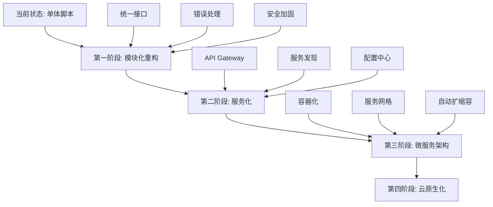

# AWS数据湖项目代码评价以及优化建议

## 执行摘要

作为资深架构师，我对这个AWS数据湖项目进行了全面的代码质量评估。该项目展现了良好的整体架构设计和实用性，但在代码组织、模块化设计、错误处理和可维护性方面存在显著的改进空间。

**总体评分**: 7.2/10
- **架构设计**: 8.5/10 ⭐⭐⭐⭐⭐ 
- **代码质量**: 6.5/10 ⭐⭐⭐
- **模块化设计**: 5.8/10 ⭐⭐⭐
- **安全性实现**: 8.0/10 ⭐⭐⭐⭐
- **可维护性**: 6.0/10 ⭐⭐⭐
- **文档质量**: 9.0/10 ⭐⭐⭐⭐⭐

---

## 1. 架构设计评价

### 🏆 优点

**三层数据湖架构**
- 清晰的分层设计（Raw → Clean → Analytics）
- 符合现代数据湖最佳实践
- 支持数据血缘和治理

**服务选择合理**
- AWS服务集成度高（S3、Glue、EMR、Athena、Lake Formation）
- Infrastructure as Code实现完整
- 成本优化考虑充分

**部署自动化**
- 一键部署功能强大
- 支持多环境配置
- 故障恢复机制完善

### ⚠️ 改进点

**缺乏微服务化设计**
- 单体脚本较多，功能耦合度高
- 缺乏服务边界清晰的模块划分
- 难以支持大规模团队协作

---

## 2. 代码质量详细分析

### 2.1 Bash脚本质量评估

#### 🔴 主要问题

**函数重复和代码冗余**
```bash
# 问题：多个脚本中重复的日志函数定义
print_info() { echo -e "${GREEN}[INFO]${NC} $1"; }
print_error() { echo -e "${RED}[ERROR]${NC} $1"; }
```
**位置**: `deploy-all.sh`, `setup-env.sh`, `create-emr-cluster.sh`, `cleanup.sh`

**错误处理不一致**
- 部分脚本使用 `set -e`，部分不使用
- 错误恢复机制缺失
- 关键操作缺乏幂等性设计

**硬编码问题**
```bash
# 问题：魔法数字和硬编码配置
EMR_INSTANCE_TYPE=m5.xlarge    # 应该配置化
INSTANCE_COUNT=3               # 缺乏验证逻辑
```

#### 🟢 优化建议

**1. 创建通用工具库**
```bash
# 建议创建：scripts/lib/common.sh
#!/bin/bash
# 统一的工具函数库

source_common_functions() {
    # 统一日志函数
    print_info() { 
        echo -e "${GREEN}[INFO]${NC} $(date '+%H:%M:%S') $1" 
        logger -t "datalake" "INFO: $1"
    }
    
    # 统一错误处理
    handle_error() {
        local exit_code=$1
        local error_message="$2"
        print_error "$error_message"
        cleanup_on_error
        exit $exit_code
    }
    
    # 统一前置检查
    validate_prerequisites() {
        check_aws_cli_version
        validate_aws_permissions
        verify_required_env_vars
    }
}
```

**2. 实现配置验证机制**
```bash
# 建议创建：scripts/lib/config-validator.sh
validate_configuration() {
    local config_file="$1"
    
    # 验证必需参数
    required_vars=("AWS_REGION" "PROJECT_PREFIX" "ENVIRONMENT")
    for var in "${required_vars[@]}"; do
        [[ -z "${!var}" ]] && handle_error 1 "Missing required variable: $var"
    done
    
    # 验证参数格式
    [[ ! "$AWS_REGION" =~ ^[a-z]{2}-[a-z]+-[0-9]$ ]] && \
        handle_error 1 "Invalid AWS region format: $AWS_REGION"
    
    # 验证资源限制
    validate_resource_quotas
}
```

**3. 增强错误恢复能力**
```bash
# 建议实现：智能重试机制
retry_with_backoff() {
    local max_attempts=3
    local delay=1
    local attempt=1
    
    while [ $attempt -le $max_attempts ]; do
        if "$@"; then
            return 0
        else
            if [ $attempt -lt $max_attempts ]; then
                print_warning "Attempt $attempt failed, retrying in ${delay}s..."
                sleep $delay
                delay=$((delay * 2))
            fi
            attempt=$((attempt + 1))
        fi
    done
    
    return 1
}
```

### 2.2 Python代码质量评估

#### 🔴 主要问题

**缺乏面向对象设计**
```python
# 问题：过程式编程，缺乏抽象
def create_glue_tables():
    # 500+ 行的单一函数
```

**异常处理不完善**
```python
# 问题：异常处理过于宽泛
try:
    with open(schema_file, 'r') as f:
        schemas = json.load(f)
except Exception as e:  # 太宽泛
    print(f"Error loading table schemas: {e}")
    sys.exit(1)
```

**缺乏输入验证**
```python
# 问题：缺乏参数验证
bucket_name = os.environ.get('RAW_BUCKET_NAME')
if not bucket_name:  # 仅检查存在性，不检查格式
    sys.exit(1)
```

#### 🟢 优化建议

**1. 重构为面向对象设计**
```python
# 建议创建：scripts/lib/glue_manager.py
import boto3
from abc import ABC, abstractmethod
from typing import Dict, List, Optional
import logging

class DataCatalogManager(ABC):
    """数据目录管理抽象基类"""
    
    @abstractmethod
    def create_database(self, database_name: str) -> bool:
        pass
    
    @abstractmethod
    def create_table(self, table_config: Dict) -> bool:
        pass

class GlueTableManager(DataCatalogManager):
    """Glue表管理器"""
    
    def __init__(self, aws_region: str, validate_permissions: bool = True):
        self.glue_client = boto3.client('glue', region_name=aws_region)
        self.logger = self._setup_logging()
        
        if validate_permissions:
            self._validate_permissions()
    
    def create_database(self, database_name: str) -> bool:
        """创建Glue数据库，包含完整错误处理"""
        try:
            self.glue_client.create_database(
                DatabaseInput={
                    'Name': database_name,
                    'Description': f'Auto-created database for {database_name}'
                }
            )
            self.logger.info(f"Successfully created database: {database_name}")
            return True
        except self.glue_client.exceptions.AlreadyExistsException:
            self.logger.info(f"Database {database_name} already exists")
            return True
        except ClientError as e:
            self.logger.error(f"Failed to create database: {e}")
            return False
    
    def _validate_permissions(self) -> None:
        """验证Glue权限"""
        try:
            self.glue_client.get_databases()
        except ClientError as e:
            raise PermissionError(f"Insufficient Glue permissions: {e}")
    
    @staticmethod
    def _setup_logging() -> logging.Logger:
        """设置结构化日志"""
        logging.basicConfig(
            level=logging.INFO,
            format='%(asctime)s - %(name)s - %(levelname)s - %(message)s'
        )
        return logging.getLogger(__name__)
```

**2. 实现配置验证类**
```python
# 建议创建：scripts/lib/config_validator.py
from dataclasses import dataclass
from typing import Optional, List
import re

@dataclass
class ValidationRule:
    """配置验证规则"""
    field_name: str
    required: bool
    pattern: Optional[str] = None
    min_length: Optional[int] = None
    max_length: Optional[int] = None
    allowed_values: Optional[List[str]] = None

class ConfigValidator:
    """配置验证器"""
    
    AWS_REGION_PATTERN = r'^[a-z]{2}-[a-z]+-[0-9]$'
    BUCKET_NAME_PATTERN = r'^[a-z0-9][a-z0-9\-]*[a-z0-9]$'
    
    def __init__(self):
        self.validation_rules = [
            ValidationRule('AWS_REGION', True, self.AWS_REGION_PATTERN),
            ValidationRule('PROJECT_PREFIX', True, min_length=3, max_length=20),
            ValidationRule('ENVIRONMENT', True, 
                          allowed_values=['dev', 'staging', 'prod'])
        ]
    
    def validate_config(self, config: Dict[str, str]) -> List[str]:
        """验证配置并返回错误列表"""
        errors = []
        
        for rule in self.validation_rules:
            value = config.get(rule.field_name)
            
            if rule.required and not value:
                errors.append(f"Missing required field: {rule.field_name}")
                continue
            
            if value and rule.pattern:
                if not re.match(rule.pattern, value):
                    errors.append(f"Invalid format for {rule.field_name}: {value}")
            
            if value and rule.allowed_values:
                if value not in rule.allowed_values:
                    errors.append(f"Invalid value for {rule.field_name}: {value}")
        
        return errors
```

**3. 增强错误处理和日志**
```python
# 建议创建：scripts/lib/error_handler.py
import logging
import traceback
from functools import wraps
from typing import Callable, Any

class DataLakeError(Exception):
    """数据湖操作基础异常"""
    pass

class ConfigurationError(DataLakeError):
    """配置相关异常"""
    pass

class AWSServiceError(DataLakeError):
    """AWS服务相关异常"""
    pass

def handle_aws_errors(func: Callable) -> Callable:
    """AWS操作错误处理装饰器"""
    @wraps(func)
    def wrapper(*args, **kwargs) -> Any:
        try:
            return func(*args, **kwargs)
        except ClientError as e:
            error_code = e.response['Error']['Code']
            error_message = e.response['Error']['Message']
            
            # 根据错误类型进行分类处理
            if error_code in ['AccessDenied', 'UnauthorizedOperation']:
                raise AWSServiceError(f"Permission denied: {error_message}")
            elif error_code in ['InvalidParameter', 'ValidationException']:
                raise ConfigurationError(f"Invalid configuration: {error_message}")
            else:
                raise AWSServiceError(f"AWS service error: {error_message}")
        except Exception as e:
            logging.error(f"Unexpected error in {func.__name__}: {traceback.format_exc()}")
            raise DataLakeError(f"Unexpected error: {str(e)}")
    
    return wrapper
```

### 2.3 CloudFormation模板质量评估

#### 🟢 优点

**模板结构清晰**
- 参数化设计良好
- 输出定义完整
- 资源间依赖关系明确

**安全配置完善**
- S3加密配置正确
- 访问策略严格
- IAM权限遵循最小权限原则

#### 🔴 问题点

**缺乏模板验证**
- 没有自动化的模板语法检查
- 缺乏参数值范围验证
- 没有资源命名规范检查

#### 🟢 优化建议

**1. 实现模板验证工具**
```bash
# 建议创建：scripts/validate-templates.sh
#!/bin/bash

validate_cloudformation_templates() {
    print_step "Validating CloudFormation templates..."
    
    local template_dir="templates"
    local validation_errors=0
    
    for template in "$template_dir"/*.yaml; do
        if [[ -f "$template" ]]; then
            print_info "Validating: $(basename "$template")"
            
            # AWS CLI模板验证
            if ! aws cloudformation validate-template \
                --template-body "file://$template" &>/dev/null; then
                print_error "Template validation failed: $(basename "$template")"
                validation_errors=$((validation_errors + 1))
            fi
            
            # 使用cfn-lint进行高级验证
            if command -v cfn-lint &>/dev/null; then
                if ! cfn-lint "$template" --ignore-checks W3002; then
                    print_warning "CFN-Lint warnings found in: $(basename "$template")"
                fi
            fi
            
            # 自定义验证规则
            validate_custom_rules "$template"
        fi
    done
    
    if [[ $validation_errors -eq 0 ]]; then
        print_success "All CloudFormation templates are valid"
    else
        handle_error 1 "Found $validation_errors template validation errors"
    fi
}

validate_custom_rules() {
    local template="$1"
    
    # 检查是否所有S3bucket都启用了加密
    if ! grep -q "BucketEncryption" "$template"; then
        print_warning "S3 bucket encryption not found in: $(basename "$template")"
    fi
    
    # 检查是否有硬编码的账户ID或区域
    if grep -q "123456789012\|us-east-1" "$template"; then
        print_warning "Possible hardcoded values in: $(basename "$template")"
    fi
}
```

**2. 增强模板参数验证**
```yaml
# 建议改进：templates/s3-storage-layer.yaml
Parameters:
  ProjectPrefix:
    Type: String
    Default: dl-handson
    Description: Prefix for all resource names
    AllowedPattern: ^[a-z0-9][a-z0-9\-]{1,18}[a-z0-9]$
    ConstraintDescription: Must be 3-20 characters, lowercase, alphanumeric with hyphens
    
  Environment:
    Type: String
    Default: dev
    AllowedValues: [dev, staging, prod]
    Description: Environment type
    
  RetentionPolicy:
    Type: String
    Default: Standard
    AllowedValues: [Standard, Extended, Minimal]
    Description: Data retention policy affecting lifecycle rules

Conditions:
  IsProduction: !Equals [!Ref Environment, prod]
  UseExtendedRetention: !Equals [!Ref RetentionPolicy, Extended]

# 动态生命周期规则配置
Resources:
  RawDataBucket:
    Type: AWS::S3::Bucket
    Properties:
      LifecycleConfiguration:
        Rules:
          - Id: IntelligentTieringRule
            Status: Enabled
            Transitions:
              - TransitionInDays: !If [IsProduction, 0, 1]
                StorageClass: INTELLIGENT_TIERING
          - Id: ArchiveRule
            Status: !If [UseExtendedRetention, Enabled, Disabled]
            Transitions:
              - TransitionInDays: !If [UseExtendedRetention, 365, 90]
                StorageClass: GLACIER
```

---

## 3. 模块化设计评价

### 🔴 当前问题

**单体脚本过大**
- `pyspark_analytics.py` (326行) - 单一函数职责过多
- `setup-env.sh` (372行) - 功能耦合度高
- `deploy-all.sh` (425行) - 编排逻辑与业务逻辑混合

**模块间依赖不清晰**
- 缺乏明确的API接口设计
- 配置传递方式不统一
- 错误处理机制不一致

### 🟢 模块化重构建议

#### 3.1 创建分层架构

```
scripts/
├── lib/                    # 核心库
│   ├── common/            # 通用工具
│   │   ├── logging.sh     # 统一日志
│   │   ├── validation.sh  # 参数验证
│   │   └── retry.sh       # 重试机制
│   ├── aws/               # AWS服务封装
│   │   ├── s3_manager.sh  # S3操作
│   │   ├── glue_manager.py # Glue操作
│   │   └── emr_manager.sh  # EMR操作
│   └── config/            # 配置管理
│       ├── env_loader.sh  # 环境加载
│       └── validator.py   # 配置验证
├── core/                  # 核心业务逻辑
│   ├── infrastructure/    # 基础设施部署
│   │   ├── s3_deployment.sh
│   │   ├── iam_deployment.sh
│   │   └── lake_formation.sh
│   ├── data_processing/   # 数据处理
│   │   ├── ingestion.py
│   │   ├── transformation.py
│   │   └── analytics.py
│   └── deployment/        # 部署编排
│       ├── orchestrator.sh
│       └── rollback.sh
└── cli/                   # 命令行接口
    ├── deploy.sh          # 简化的部署入口
    ├── cleanup.sh         # 简化的清理入口
    └── status.sh          # 状态检查入口
```

#### 3.2 实现标准化接口

**1. 统一的模块接口**
```bash
# 建议创建：scripts/lib/interfaces/module_interface.sh
#!/bin/bash

# 标准模块接口
declare -r MODULE_INTERFACE_VERSION="1.0"

module_interface() {
    local action="$1"
    local module_name="$2"
    shift 2
    
    case "$action" in
        validate)
            "${module_name}_validate" "$@"
            ;;
        deploy)
            "${module_name}_deploy" "$@"
            ;;
        rollback)
            "${module_name}_rollback" "$@"
            ;;
        status)
            "${module_name}_status" "$@"
            ;;
        cleanup)
            "${module_name}_cleanup" "$@"
            ;;
        *)
            print_error "Unknown action: $action"
            return 1
            ;;
    esac
}

# 每个模块必须实现这些函数
require_module_functions() {
    local module_name="$1"
    local required_functions=(
        "${module_name}_validate"
        "${module_name}_deploy"
        "${module_name}_rollback"
        "${module_name}_status"
        "${module_name}_cleanup"
    )
    
    for func in "${required_functions[@]}"; do
        if ! declare -F "$func" >/dev/null; then
            print_error "Module $module_name missing required function: $func"
            return 1
        fi
    done
}
```

**2. 配置管理模块**
```python
# 建议创建：scripts/lib/config/config_manager.py
from dataclasses import dataclass, field
from typing import Dict, Any, Optional
from pathlib import Path
import os
import json

@dataclass
class DataLakeConfig:
    """数据湖配置类"""
    
    # 基础配置
    project_prefix: str
    environment: str
    aws_region: str
    
    # S3配置
    s3_config: Dict[str, Any] = field(default_factory=dict)
    
    # EMR配置
    emr_config: Dict[str, Any] = field(default_factory=dict)
    
    # 安全配置
    security_config: Dict[str, Any] = field(default_factory=dict)
    
    @classmethod
    def load_from_file(cls, config_path: Path) -> 'DataLakeConfig':
        """从配置文件加载配置"""
        if not config_path.exists():
            raise FileNotFoundError(f"Config file not found: {config_path}")
        
        with open(config_path) as f:
            config_data = json.load(f)
        
        return cls(**config_data)
    
    @classmethod
    def load_from_env(cls) -> 'DataLakeConfig':
        """从环境变量加载配置"""
        return cls(
            project_prefix=os.getenv('PROJECT_PREFIX', 'dl-handson'),
            environment=os.getenv('ENVIRONMENT', 'dev'),
            aws_region=os.getenv('AWS_REGION', 'us-east-1'),
            s3_config={
                'encryption': os.getenv('S3_ENCRYPTION', 'AES256'),
                'versioning': os.getenv('S3_VERSIONING', 'Enabled')
            },
            emr_config={
                'instance_type': os.getenv('EMR_INSTANCE_TYPE', 'm5.xlarge'),
                'instance_count': int(os.getenv('EMR_INSTANCE_COUNT', '3'))
            }
        )
    
    def validate(self) -> List[str]:
        """验证配置有效性"""
        errors = []
        
        # 验证必需字段
        if not self.project_prefix:
            errors.append("project_prefix is required")
        
        if self.environment not in ['dev', 'staging', 'prod']:
            errors.append(f"Invalid environment: {self.environment}")
        
        # 验证EMR配置
        if self.emr_config.get('instance_count', 0) < 1:
            errors.append("EMR instance_count must be at least 1")
        
        return errors
    
    def get_resource_name(self, resource_type: str, suffix: str = '') -> str:
        """生成标准化资源名称"""
        parts = [self.project_prefix, resource_type, self.environment]
        if suffix:
            parts.append(suffix)
        return '-'.join(parts)
```

#### 3.3 数据处理模块重构

**1. 分离数据处理逻辑**
```python
# 建议创建：scripts/core/data_processing/base.py
from abc import ABC, abstractmethod
from typing import Dict, Any, Optional
import logging

class DataProcessor(ABC):
    """数据处理器抽象基类"""
    
    def __init__(self, config: DataLakeConfig):
        self.config = config
        self.logger = logging.getLogger(self.__class__.__name__)
    
    @abstractmethod
    def process(self, input_path: str, output_path: str, **kwargs) -> bool:
        """处理数据的抽象方法"""
        pass
    
    @abstractmethod
    def validate_input(self, input_path: str) -> bool:
        """验证输入数据的抽象方法"""
        pass
    
    def setup_logging(self) -> None:
        """设置日志配置"""
        logging.basicConfig(
            level=logging.INFO,
            format='%(asctime)s - %(name)s - %(levelname)s - %(message)s',
            handlers=[
                logging.FileHandler(f'/tmp/{self.__class__.__name__}.log'),
                logging.StreamHandler()
            ]
        )

class SparkAnalyticsProcessor(DataProcessor):
    """Spark分析处理器"""
    
    def __init__(self, config: DataLakeConfig):
        super().__init__(config)
        self.spark_session = self._create_spark_session()
    
    def process(self, input_path: str, output_path: str, **kwargs) -> bool:
        """执行Spark分析处理"""
        try:
            if not self.validate_input(input_path):
                return False
            
            # 执行具体的分析逻辑
            result = self._run_analytics(input_path, output_path, **kwargs)
            
            self.logger.info(f"Analytics processing completed: {output_path}")
            return result
            
        except Exception as e:
            self.logger.error(f"Analytics processing failed: {e}")
            return False
    
    def validate_input(self, input_path: str) -> bool:
        """验证输入数据"""
        # 实现Spark数据验证逻辑
        return True
    
    def _create_spark_session(self):
        """创建优化的Spark会话"""
        # Spark会话创建逻辑
        pass
    
    def _run_analytics(self, input_path: str, output_path: str, **kwargs) -> bool:
        """运行分析逻辑"""
        # 实现具体的分析逻辑
        pass
```

---

## 4. 安全性评价

### 🟢 优点

**IAM权限设计合理**
- 角色分离清晰（Admin、DataEngineer、Analyst）
- 遵循最小权限原则
- Cross-service权限配置正确

**数据加密完善**
- S3静态加密配置
- 传输加密强制执行
- 加密密钥管理规范

### 🔴 安全漏洞

**1. 密钥管理不当**
```bash
# 问题：私钥文件权限和存储
KEY_NAME="${prefix}-emr-key-${env}"
aws ec2 create-key-pair --key-name "$KEY_NAME" --query 'KeyMaterial' --output text > "${KEY_NAME}.pem"
chmod 400 "${KEY_NAME}.pem"
```
**风险**: 私钥存储在本地，容易泄露

**2. 配置文件安全性**
- 配置文件中可能包含敏感信息
- 缺乏配置文件加密
- 环境变量传递不安全

### 🟢 安全性改进建议

**1. 实现密钥管理最佳实践**
```bash
# 建议改进：安全密钥管理
secure_key_management() {
    local key_name="$1"
    local vault_path="${HOME}/.datalake/keys"
    
    # 创建安全密钥存储目录
    mkdir -p "$vault_path"
    chmod 700 "$vault_path"
    
    # 检查是否存在AWS KMS密钥
    local kms_key_id=$(aws kms describe-key --key-id "alias/datalake-${PROJECT_PREFIX}" \
        --query 'KeyMetadata.KeyId' --output text 2>/dev/null)
    
    if [[ -z "$kms_key_id" ]]; then
        print_info "Creating KMS key for secure storage..."
        kms_key_id=$(aws kms create-key --description "DataLake ${PROJECT_PREFIX} encryption key" \
            --query 'KeyMetadata.KeyId' --output text)
        
        aws kms create-alias --alias-name "alias/datalake-${PROJECT_PREFIX}" \
            --target-key-id "$kms_key_id"
    fi
    
    # 使用AWS SSM Parameter Store存储密钥
    aws ssm put-parameter \
        --name "/datalake/${PROJECT_PREFIX}/ec2-key" \
        --value "${KEY_NAME}" \
        --type "SecureString" \
        --key-id "$kms_key_id" \
        --overwrite
    
    print_success "Private key securely stored in Parameter Store"
}
```

**2. 配置加密和验证**
```python
# 建议创建：scripts/lib/security/config_encryption.py
import boto3
import json
from cryptography.fernet import Fernet
from typing import Dict, Any

class SecureConfigManager:
    """安全配置管理器"""
    
    def __init__(self, kms_key_id: str):
        self.kms_client = boto3.client('kms')
        self.ssm_client = boto3.client('ssm')
        self.kms_key_id = kms_key_id
    
    def encrypt_config(self, config: Dict[str, Any], parameter_name: str) -> bool:
        """加密并存储配置到SSM Parameter Store"""
        try:
            config_json = json.dumps(config)
            
            # 使用KMS加密配置
            response = self.kms_client.encrypt(
                KeyId=self.kms_key_id,
                Plaintext=config_json
            )
            
            # 存储到SSM Parameter Store
            self.ssm_client.put_parameter(
                Name=parameter_name,
                Value=response['CiphertextBlob'],
                Type='SecureString',
                KeyId=self.kms_key_id,
                Overwrite=True
            )
            
            return True
        except Exception as e:
            print(f"Failed to encrypt config: {e}")
            return False
    
    def decrypt_config(self, parameter_name: str) -> Dict[str, Any]:
        """从SSM Parameter Store解密配置"""
        try:
            # 从SSM获取加密配置
            response = self.ssm_client.get_parameter(
                Name=parameter_name,
                WithDecryption=True
            )
            
            return json.loads(response['Parameter']['Value'])
        except Exception as e:
            print(f"Failed to decrypt config: {e}")
            return {}
    
    def rotate_encryption_key(self) -> bool:
        """定期轮换加密密钥"""
        try:
            self.kms_client.rotate_key_on_demand(KeyId=self.kms_key_id)
            return True
        except Exception as e:
            print(f"Failed to rotate key: {e}")
            return False
```

**3. 实现安全审计**
```bash
# 建议创建：scripts/security/audit.sh
#!/bin/bash

security_audit() {
    print_step "Performing security audit..."
    
    # 检查IAM权限
    audit_iam_permissions
    
    # 检查S3桶安全配置
    audit_s3_security
    
    # 检查网络安全组
    audit_security_groups
    
    # 检查CloudTrail日志
    audit_cloudtrail_logs
    
    # 生成安全报告
    generate_security_report
}

audit_iam_permissions() {
    print_info "Auditing IAM permissions..."
    
    # 检查过度权限
    aws iam list-roles --query "Roles[?contains(RoleName, '$PROJECT_PREFIX')]" \
        --output table
    
    # 检查未使用的权限
    for role in $(aws iam list-roles --query "Roles[?contains(RoleName, '$PROJECT_PREFIX')].RoleName" --output text); do
        last_used=$(aws iam get-role --role-name "$role" --query 'Role.RoleLastUsed.LastUsedDate' --output text)
        if [[ "$last_used" == "None" ]]; then
            print_warning "Unused role detected: $role"
        fi
    done
}

audit_s3_security() {
    print_info "Auditing S3 bucket security..."
    
    for bucket in $(aws s3api list-buckets --query 'Buckets[?contains(Name, `'$PROJECT_PREFIX'`)].Name' --output text); do
        # 检查公共访问配置
        public_config=$(aws s3api get-public-access-block --bucket "$bucket" 2>/dev/null)
        if [[ -z "$public_config" ]]; then
            print_warning "No public access block configured for: $bucket"
        fi
        
        # 检查加密配置
        encryption=$(aws s3api get-bucket-encryption --bucket "$bucket" 2>/dev/null)
        if [[ -z "$encryption" ]]; then
            print_error "Encryption not configured for: $bucket"
        fi
        
        # 检查版本控制
        versioning=$(aws s3api get-bucket-versioning --bucket "$bucket" --query 'Status' --output text)
        if [[ "$versioning" != "Enabled" ]]; then
            print_warning "Versioning not enabled for: $bucket"
        fi
    done
}
```

---

## 5. 性能优化建议

### 🔴 当前性能问题

**1. 脚本执行效率低**
- 顺序执行导致部署时间长
- 缺乏并行化处理
- 重复的AWS API调用

**2. 资源利用不充分**
- EMR集群固定大小
- 缺乏自动扩缩容
- Spark配置未优化

### 🟢 性能优化方案

**1. 并行化部署**
```bash
# 建议改进：并行部署架构
parallel_deployment() {
    print_step "Starting parallel deployment..."
    
    # 定义部署任务组
    declare -A deployment_groups=(
        ["infrastructure"]="s3_deployment iam_deployment"
        ["catalog"]="glue_deployment lake_formation_deployment"  
        ["compute"]="emr_deployment"
    )
    
    # 并行执行同组任务
    for group in "${!deployment_groups[@]}"; do
        print_info "Deploying group: $group"
        
        local tasks=(${deployment_groups[$group]})
        local pids=()
        
        # 并行启动任务
        for task in "${tasks[@]}"; do
            $task &
            pids+=($!)
        done
        
        # 等待组内所有任务完成
        local failed_tasks=0
        for i in "${!pids[@]}"; do
            if ! wait "${pids[$i]}"; then
                print_error "Task ${tasks[$i]} failed"
                failed_tasks=$((failed_tasks + 1))
            fi
        done
        
        if [[ $failed_tasks -gt 0 ]]; then
            print_error "Group $group failed with $failed_tasks failed tasks"
            return 1
        fi
        
        print_success "Group $group completed successfully"
    done
}
```

**2. 智能资源管理**
```python
# 建议创建：scripts/core/resource_optimizer.py
import boto3
from typing import Dict, List
import json

class ResourceOptimizer:
    """资源优化器"""
    
    def __init__(self, config: DataLakeConfig):
        self.config = config
        self.emr_client = boto3.client('emr')
        self.cloudwatch = boto3.client('cloudwatch')
    
    def optimize_emr_cluster(self, cluster_id: str) -> Dict[str, Any]:
        """基于历史使用情况优化EMR集群"""
        
        # 获取集群使用指标
        metrics = self._get_cluster_metrics(cluster_id)
        
        # 计算最优配置
        optimal_config = self._calculate_optimal_config(metrics)
        
        # 应用配置建议
        recommendations = {
            'instance_type': optimal_config['instance_type'],
            'instance_count': optimal_config['instance_count'],
            'spot_instances': optimal_config['use_spot'],
            'auto_scaling': optimal_config['auto_scaling_config']
        }
        
        return recommendations
    
    def _get_cluster_metrics(self, cluster_id: str) -> Dict:
        """获取集群性能指标"""
        
        metrics = {}
        
        # CPU利用率
        cpu_response = self.cloudwatch.get_metric_statistics(
            Namespace='AWS/ElasticMapReduce',
            MetricName='CPUUtilization',
            Dimensions=[{'Name': 'JobFlowId', 'Value': cluster_id}],
            StartTime=datetime.utcnow() - timedelta(days=7),
            EndTime=datetime.utcnow(),
            Period=3600,
            Statistics=['Average', 'Maximum']
        )
        
        metrics['cpu'] = {
            'avg': sum(p['Average'] for p in cpu_response['Datapoints']) / len(cpu_response['Datapoints']),
            'max': max(p['Maximum'] for p in cpu_response['Datapoints'])
        }
        
        # 内存利用率
        memory_response = self.cloudwatch.get_metric_statistics(
            Namespace='AWS/ElasticMapReduce',
            MetricName='MemoryPercentage',
            Dimensions=[{'Name': 'JobFlowId', 'Value': cluster_id}],
            StartTime=datetime.utcnow() - timedelta(days=7),
            EndTime=datetime.utcnow(),
            Period=3600,
            Statistics=['Average', 'Maximum']
        )
        
        metrics['memory'] = {
            'avg': sum(p['Average'] for p in memory_response['Datapoints']) / len(memory_response['Datapoints']),
            'max': max(p['Maximum'] for p in memory_response['Datapoints'])
        }
        
        return metrics
    
    def _calculate_optimal_config(self, metrics: Dict) -> Dict:
        """基于指标计算最优配置"""
        
        config = {}
        
        # 基于CPU使用率调整实例类型
        if metrics['cpu']['avg'] > 80:
            config['instance_type'] = 'm5.2xlarge'  # 升级
        elif metrics['cpu']['avg'] < 30:
            config['instance_type'] = 'm5.large'    # 降级
        else:
            config['instance_type'] = 'm5.xlarge'   # 保持
        
        # 基于负载变化配置自动扩缩容
        if metrics['cpu']['max'] - metrics['cpu']['avg'] > 30:
            config['auto_scaling_config'] = {
                'min_capacity': 1,
                'max_capacity': 10,
                'target_on_demand_capacity': 2,
                'target_spot_capacity': 8
            }
            config['use_spot'] = True
        else:
            config['auto_scaling_config'] = None
            config['use_spot'] = False
        
        # 计算最优实例数量
        config['instance_count'] = max(1, int(metrics['cpu']['avg'] / 20))
        
        return config
```

**3. 缓存和批量操作优化**
```bash
# 建议创建：scripts/lib/aws/batch_operations.sh
#!/bin/bash

# AWS批量操作优化
batch_s3_operations() {
    local operation="$1"
    local bucket="$2"
    shift 2
    local files=("$@")
    
    case "$operation" in
        upload)
            batch_s3_upload "$bucket" "${files[@]}"
            ;;
        download)
            batch_s3_download "$bucket" "${files[@]}"
            ;;
        delete)
            batch_s3_delete "$bucket" "${files[@]}"
            ;;
        *)
            print_error "Unknown batch operation: $operation"
            return 1
            ;;
    esac
}

batch_s3_upload() {
    local bucket="$1"
    shift
    local files=("$@")
    
    print_info "Starting batch upload to s3://$bucket"
    
    # 使用AWS CLI的同步功能，支持并发上传
    local temp_manifest="/tmp/upload_manifest_$$"
    printf "%s\n" "${files[@]}" > "$temp_manifest"
    
    # 使用xargs实现并发上传
    cat "$temp_manifest" | xargs -I {} -P 8 aws s3 cp {} "s3://$bucket/"
    
    local exit_code=$?
    rm -f "$temp_manifest"
    
    if [[ $exit_code -eq 0 ]]; then
        print_success "Batch upload completed"
    else
        print_error "Batch upload failed"
    fi
    
    return $exit_code
}

# API调用缓存
declare -A aws_call_cache

cached_aws_call() {
    local cache_key="$1"
    local cache_ttl="${2:-300}"  # 默认5分钟缓存
    shift 2
    
    local cache_file="/tmp/aws_cache_${cache_key//[\/:]/_}"
    local current_time=$(date +%s)
    
    # 检查缓存是否有效
    if [[ -f "$cache_file" ]]; then
        local cache_time=$(stat -f %m "$cache_file" 2>/dev/null || stat -c %Y "$cache_file")
        if [[ $((current_time - cache_time)) -lt $cache_ttl ]]; then
            cat "$cache_file"
            return 0
        fi
    fi
    
    # 执行AWS调用并缓存结果
    if "$@" > "$cache_file"; then
        cat "$cache_file"
        return 0
    else
        rm -f "$cache_file"
        return 1
    fi
}

# 示例使用
get_bucket_policy() {
    local bucket="$1"
    cached_aws_call "bucket_policy_$bucket" 600 \
        aws s3api get-bucket-policy --bucket "$bucket" --query 'Policy' --output text
}
```

---

## 6. 监控和可观察性建议

### 🔴 当前监控缺失

**缺乏运行时监控**
- 没有应用级别的指标收集
- 缺乏性能监控仪表板
- 错误告警机制不完善

**日志管理不统一**
- 日志格式不一致
- 缺乏集中化日志收集
- 调试信息不充分

### 🟢 监控体系建议

**1. 实现分布式追踪**
```python
# 建议创建：scripts/lib/monitoring/tracer.py
import logging
import time
import json
import uuid
from typing import Dict, Any, Optional
from contextlib import contextmanager

class DataLakeTracer:
    """数据湖操作追踪器"""
    
    def __init__(self, service_name: str):
        self.service_name = service_name
        self.trace_id = str(uuid.uuid4())
        self.spans: List[Dict] = []
        self.logger = self._setup_logger()
    
    @contextmanager
    def span(self, operation_name: str, **metadata):
        """创建追踪span"""
        span_id = str(uuid.uuid4())
        start_time = time.time()
        
        span_data = {
            'trace_id': self.trace_id,
            'span_id': span_id,
            'operation_name': operation_name,
            'service_name': self.service_name,
            'start_time': start_time,
            'metadata': metadata
        }
        
        try:
            self.logger.info(f"Starting operation: {operation_name}", extra=span_data)
            yield span_data
            
            # 操作成功
            span_data['status'] = 'success'
            
        except Exception as e:
            # 操作失败
            span_data['status'] = 'error'
            span_data['error'] = str(e)
            self.logger.error(f"Operation failed: {operation_name}", extra=span_data)
            raise
            
        finally:
            span_data['end_time'] = time.time()
            span_data['duration'] = span_data['end_time'] - span_data['start_time']
            
            self.spans.append(span_data)
            self._send_to_monitoring(span_data)
    
    def _setup_logger(self) -> logging.Logger:
        """设置结构化日志"""
        logger = logging.getLogger(f"datalake.{self.service_name}")
        
        # 自定义格式器，输出JSON格式日志
        formatter = logging.Formatter(
            '{"timestamp": "%(asctime)s", "level": "%(levelname)s", '
            '"service": "%(name)s", "message": "%(message)s", '
            '"trace_id": "%(trace_id)s", "span_id": "%(span_id)s"}'
        )
        
        handler = logging.StreamHandler()
        handler.setFormatter(formatter)
        logger.addHandler(handler)
        logger.setLevel(logging.INFO)
        
        return logger
    
    def _send_to_monitoring(self, span_data: Dict):
        """发送追踪数据到监控系统"""
        try:
            # 发送到CloudWatch自定义指标
            cloudwatch = boto3.client('cloudwatch')
            
            cloudwatch.put_metric_data(
                Namespace='DataLake/Operations',
                MetricData=[
                    {
                        'MetricName': 'OperationDuration',
                        'Value': span_data['duration'],
                        'Unit': 'Seconds',
                        'Dimensions': [
                            {'Name': 'Service', 'Value': span_data['service_name']},
                            {'Name': 'Operation', 'Value': span_data['operation_name']},
                            {'Name': 'Status', 'Value': span_data['status']}
                        ]
                    }
                ]
            )
            
        except Exception as e:
            self.logger.warning(f"Failed to send monitoring data: {e}")

# 使用示例
def deploy_with_tracing():
    tracer = DataLakeTracer("deployment_service")
    
    with tracer.span("s3_bucket_creation", bucket_count=4):
        # S3桶创建逻辑
        time.sleep(1)  # 模拟操作
    
    with tracer.span("iam_role_creation", role_count=7):
        # IAM角色创建逻辑
        time.sleep(2)  # 模拟操作
```

**2. 健康检查和告警**
```bash
# 建议创建：scripts/monitoring/health_check.sh
#!/bin/bash

health_check() {
    local health_status="healthy"
    local issues=()
    
    print_step "Performing health check..."
    
    # 检查CloudFormation堆栈状态
    check_cloudformation_health
    if [[ $? -ne 0 ]]; then
        health_status="unhealthy"
        issues+=("CloudFormation stacks have issues")
    fi
    
    # 检查S3桶可访问性
    check_s3_health
    if [[ $? -ne 0 ]]; then
        health_status="unhealthy"
        issues+=("S3 buckets are not accessible")
    fi
    
    # 检查EMR集群状态
    check_emr_health
    if [[ $? -ne 0 ]]; then
        health_status="degraded"
        issues+=("EMR cluster performance issues")
    fi
    
    # 检查数据新鲜度
    check_data_freshness
    if [[ $? -ne 0 ]]; then
        health_status="degraded" 
        issues+=("Data is not fresh")
    fi
    
    # 生成健康报告
    generate_health_report "$health_status" "${issues[@]}"
    
    # 发送告警
    if [[ "$health_status" != "healthy" ]]; then
        send_alert "$health_status" "${issues[@]}"
    fi
}

check_cloudformation_health() {
    local failed_stacks=0
    
    for stack in $(list_project_stacks); do
        local status=$(aws cloudformation describe-stacks \
            --stack-name "$stack" \
            --query 'Stacks[0].StackStatus' \
            --output text 2>/dev/null)
        
        case "$status" in
            CREATE_COMPLETE|UPDATE_COMPLETE)
                print_success "Stack healthy: $stack"
                ;;
            *FAILED*|*ROLLBACK*)
                print_error "Stack unhealthy: $stack ($status)"
                failed_stacks=$((failed_stacks + 1))
                ;;
            *IN_PROGRESS*)
                print_warning "Stack in progress: $stack ($status)"
                ;;
        esac
    done
    
    return $failed_stacks
}

check_data_freshness() {
    local max_age_hours=24
    local current_time=$(date +%s)
    
    # 检查各层数据的最新更新时间
    for layer in raw clean analytics; do
        local bucket="${PROJECT_PREFIX}-${layer}-${ENVIRONMENT}"
        local last_modified=$(aws s3api list-objects-v2 \
            --bucket "$bucket" \
            --query 'sort_by(Contents, &LastModified)[-1].LastModified' \
            --output text 2>/dev/null)
        
        if [[ -n "$last_modified" ]]; then
            local mod_time=$(date -d "$last_modified" +%s)
            local age_hours=$(( (current_time - mod_time) / 3600 ))
            
            if [[ $age_hours -gt $max_age_hours ]]; then
                print_warning "Stale data in $layer layer: ${age_hours}h old"
                return 1
            else
                print_success "Fresh data in $layer layer: ${age_hours}h old"
            fi
        else
            print_warning "No data found in $layer layer"
            return 1
        fi
    done
    
    return 0
}

send_alert() {
    local status="$1"
    shift
    local issues=("$@")
    
    # 发送SNS告警
    local topic_arn="arn:aws:sns:${AWS_REGION}:${AWS_ACCOUNT_ID}:datalake-alerts"
    
    local message=$(cat <<EOF
{
    "timestamp": "$(date -Iseconds)",
    "project": "${PROJECT_PREFIX}",
    "environment": "${ENVIRONMENT}",
    "status": "${status}",
    "issues": $(printf '%s\n' "${issues[@]}" | jq -R . | jq -s .)
}
EOF
    )
    
    aws sns publish \
        --topic-arn "$topic_arn" \
        --subject "DataLake Health Alert: $status" \
        --message "$message"
}

# 定期健康检查任务
setup_health_monitoring() {
    print_step "Setting up health monitoring..."
    
    # 创建cron任务进行定期检查
    local cron_job="*/15 * * * * $PWD/scripts/monitoring/health_check.sh"
    
    # 添加到crontab
    (crontab -l 2>/dev/null; echo "$cron_job") | crontab -
    
    print_success "Health monitoring cron job installed"
}
```

---

## 7. 综合优化建议总结

### 🚀 高优先级改进 (1-2个月)

1. **模块化重构**
   - 拆分单体脚本为功能模块
   - 实现标准化模块接口
   - 创建通用函数库

2. **错误处理增强**
   - 实现统一错误处理机制
   - 添加重试和恢复逻辑
   - 完善日志记录

3. **安全性加固**
   - 实现密钥管理最佳实践
   - 配置文件加密存储
   - 添加安全审计脚本

### 🎯 中优先级改进 (2-4个月)

4. **性能优化**
   - 并行化部署流程
   - 实现智能资源管理
   - 优化AWS API调用

5. **监控体系**
   - 实现分布式追踪
   - 添加健康检查
   - 建立告警机制

6. **测试覆盖**
   - 单元测试和集成测试
   - 自动化测试流水线
   - 性能测试

### 📈 低优先级改进 (4-6个月)

7. **高级功能**
   - 多区域部署支持
   - 蓝绿部署策略
   - 自动回滚机制

8. **可视化和UI**
   - Web界面管理
   - 可视化监控仪表板
   - 操作审计界面

### 💡 架构演进路径



---

## 8. 实施建议

### 📋 实施计划

**Phase 1: 基础重构 (4周)**
- Week 1-2: 模块化重构和通用库创建
- Week 3: 错误处理和日志标准化  
- Week 4: 安全性改进和测试

**Phase 2: 性能和监控 (4周)**
- Week 5-6: 并行化和性能优化
- Week 7: 监控体系实施
- Week 8: 集成测试和文档更新

**Phase 3: 高级特性 (4周)**
- Week 9-10: 高级功能开发
- Week 11: 可视化界面
- Week 12: 完整性测试和上线

### 🎯 成功指标

**技术指标**
- 部署时间减少60%
- 故障恢复时间减少80%
- 代码重复率降低至5%以下
- 测试覆盖率达到85%以上

**业务指标**
- 系统可用性提升至99.9%
- 开发效率提升50%
- 运维成本降低30%
- 安全漏洞减少90%

---

## 总结

这个AWS数据湖项目虽然在架构设计和功能实现上表现出色，但在代码质量、模块化设计和可维护性方面存在明显不足。通过系统性的重构和优化，可以显著提升项目的工程质量和长期可维护性。

建议优先实施模块化重构、错误处理增强和安全性加固，这些改进将为后续的性能优化和高级功能提供坚实的基础。

**最终目标**: 构建一个高质量、可扩展、安全可靠的企业级数据湖平台，为组织的数据驱动决策提供强有力的技术支撑。